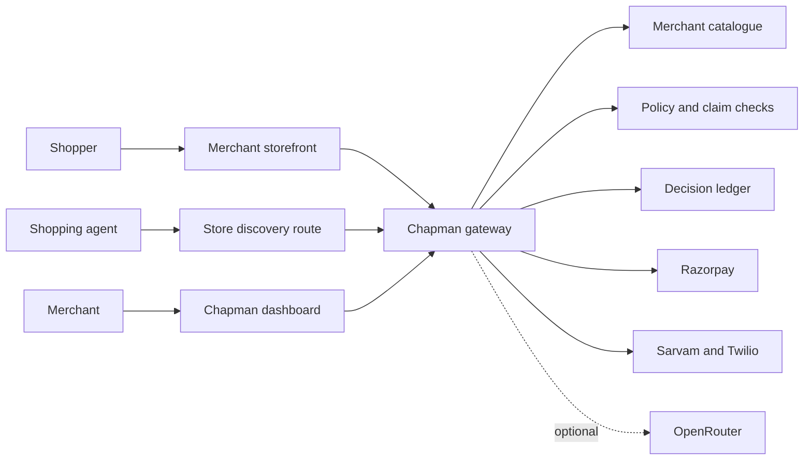

# Chapman

Chapman is a self-hosted gateway for AI-assisted shopping. It adds two
interfaces to a merchant's store:

- a chat assistant for shoppers;
- an agent-readable API for catalogue search, carts, checkout, orders, and
  offers.

Both interfaces use the same catalogue, prices, approvals, and safety checks.
Models can help write responses, but server code controls claims, permissions,
and payments.

This is a student buildathon project. The custom storefront demo can be run
locally and tested end to end. The current limitations are listed below.

[Read the engineering retrospective: What broke @2am](#what-broke-2am)

## Main features

| Feature | Purpose |
|---|---|
| Storefront assistant | Answers from the merchant's live catalogue and policies |
| Agent front | Publishes UCP over MCP for shopping agents |
| Feature controls | Lets the merchant withdraw specific capabilities |
| Razorpay checkout | Creates orders and verifies payment settlement |
| Offers | Requires merchant approval before a promotion can be claimed or applied |
| Recovery | Reviews incomplete carts and supports configured voice calls |
| Shopper memory | Stores limited preferences for signed-in shoppers |
| Shop cortex and Analyst | Provides merchant-side context and read-only analysis |
| Decision ledger and Test bench | Records decisions and tests live guardrails |

The bundled storefront is **Monsoon Market**. It is a small Go application used
only to demonstrate the integration.

## Architecture



Model output is never sent directly to a shopper and never decides a price.
See [docs/architecture.md](docs/architecture.md) for per-feature diagrams.

## Run the Docker demo

Requirements:

- Docker Desktop with Docker Compose;
- Node.js `>=20.19 <22` or `>=22.12` to generate the clean demo store;
- ports `3000` and `4000` available.

From the repository root:

```bash
cd agent-gateway
npm install
npm run demo:clean-store
cd ..
docker compose --profile demo up -d --build
docker compose logs gateway
```

If the root `.env` does not exist, copy `.env.docker.example` to `.env` first.
Do not overwrite an existing `.env`.

Open:

- storefront: <http://localhost:4000>
- merchant login: <http://localhost:3000/login>

The gateway log prints a merchant email and password on the first boot.

### Confirm the initial state

The storefront should have no assistant bubble. This should return 404:

```bash
curl -i http://localhost:4000/.well-known/ucp
```

Chapman starts with no registered storefront. It does not load the catalogue or
claim an integration is installed before the merchant configures it.

### Register Monsoon Market

Sign in and select **Configure your storefront**.

| Field | Value |
|---|---|
| Store name | `Monsoon Market` |
| Public site key | `pk_monsoon_market` |
| Browser origin | `http://localhost:4000` |
| Catalogue URL | `http://store:4000/catalog.json` |
| Product URL template | `/product.html?handle={handle}` |
| Order feed | leave blank |

Select **Configure Razorpay for this storefront** only if Razorpay will be used.
Saving registers the store and creates its signing secret. It does not install
the assistant or agent discovery route.

### Install the storefront interfaces

1. Open **Assistant** and paste its generated script tag into
   `demo-store-clean/index.html` before `</body>`.
2. Refresh the storefront. No rebuild is needed.
3. Open **Agent front** and review the generated discovery instructions.
4. For the bundled demo, set `DEMO_STORE_CHAPMAN=true` in `.env` and run:

   ```bash
   docker compose --profile demo up -d store
   ```

5. Use **Verify install** on Agent front.

A real storefront should add the generated `/.well-known/ucp` redirect or
proxy. `DEMO_STORE_CHAPMAN` is only for the bundled demo.

## Configure provider keys

Provider secrets go in the root `.env`, never in storefront code or
`chapman.config.json`. Apply changes with:

```bash
docker compose up -d gateway
```

| Page | Required configuration |
|---|---|
| Assistant | `OPENROUTER_API_KEY` is optional; the safe fallback works without it |
| Agent front | Razorpay needs `RAZORPAY_KEY_ID` and `RAZORPAY_KEY_SECRET` |
| Analyst | `OPENROUTER_API_KEY` is required |
| Shopper memory | OpenRouter summarisation is optional |
| Recovery | Voice needs Sarvam, Twilio SID, Twilio token, Twilio number, and `PUBLIC_ORIGIN` |

Each feature page shows its exact variables and whether they are configured.
Razorpay also requires the setup checkbox when the store is registered.

See [docs/configuration.md](docs/configuration.md) for the complete key matrix,
webhook setup, tunnel setup, and model overrides.

## Test the setup

- **Assistant** has **Test chat assistant**. It runs the real assistant pipeline
  against the live catalogue and shows tools, routing, products, and blocked
  checks.
- **Recovery** has **Place test call**. It requires an E.164 number and consent.
  This is a real Twilio call and can use provider credit.

Run the automated checks with:

```bash
docker compose run --rm gateway npm run doctor
docker compose run --rm gateway npm run check
```

## Install with a coding agent

Paste this into a coding agent while its workspace is the repository root:

```text
Install and verify Chapman with Docker. Read README.md, INSTALL.md,
docs/configuration.md, .env.docker.example, docker-compose.yml, and applicable
AGENTS.md first. Preserve my .env, worktree, and Docker volume. Keep the first
run unconfigured: do not enable CHAPMAN_AUTO_INIT or CHAPMAN_SEED, load a demo
fixture, invent keys, expose secrets, or run docker compose down -v without my
approval.

Generate and start the clean Monsoon Market demo. Verify that it initially has
no assistant and returns 404 at /.well-known/ucp. Pause for me to confirm the
Configure your storefront form. Then follow the Assistant and Agent front setup
instructions. Ask only for keys needed by features I choose. Do not place a
real call without an E.164 number, an expecting recipient, and my explicit
request. Run doctor and the tests. Report registered, installed,
provider-configured, fallback, and manual states separately without printing
secrets.
```

The full prompt is in
[docs/agentic-install.md](docs/agentic-install.md).

## Run without Docker

For a dashboard-first development setup:

```bash
cd agent-gateway
npm install
npm run bootstrap
npm run dev:gateway
```

For command-line storefront setup:

```bash
cd agent-gateway
npm install
npm run init
npm run doctor
npm run dev:gateway
```

See [INSTALL.md](INSTALL.md) for the full native and production setup.

## Project status

Implemented:

- clean first-store onboarding;
- custom storefront assistant and agent discovery;
- catalogue grounding, approvals, and server-side claim checks;
- Razorpay checkout and settlement verification;
- recovery, voice, shopper memory, analyst, cortex, ledger, and test bench;
- Docker setup, persistent data, doctor, and automated tests.

Current limitations:

- application state is file-backed;
- the public agent surface does not have general rate limiting;
- WhatsApp, SMS, and email delivery are not implemented;
- shopper-memory search is lexical rather than semantic;
- production deployment still requires HTTPS, backups, secret management, and
  normal server hardening.

## Documentation

| Document | Purpose |
|---|---|
| [INSTALL.md](INSTALL.md) | Docker, native, and production installation |
| [docs/configuration.md](docs/configuration.md) | Provider keys and integration tests |
| [docs/agentic-install.md](docs/agentic-install.md) | Full coding-agent setup prompt |
| [docs/architecture.md](docs/architecture.md) | System and per-feature diagrams |
| [docs/catalog-format.md](docs/catalog-format.md) | Catalogue JSON format |
| [docs/demo-plan.md](docs/demo-plan.md) | Demo runbook |
| [docs/troubleshooting.md](docs/troubleshooting.md) | Common failures |

## What broke @2am

The hardest part was not adding a chat bubble. It was designing an installation
and tool architecture that could fit into an existing independent merchant
website without forcing the merchant to rebuild the store around Chapman.

Independent stores use different frameworks, hosts, product schemas, login
systems, and checkout flows. Requiring a specific database, JavaScript
framework, product platform, or page structure would make the integration easy
for Chapman and expensive for the merchant.

We reduced the required contract to a few things:

- one public JSON catalogue feed;
- the exact browser origin of the storefront;
- one script tag for the assistant;
- one redirect or proxy route for agent discovery.

Payments, order access, memory, recovery, and voice are optional layers. A store
can add them later without replacing its existing storefront or checkout.

The second difficult problem was gathering useful data without making shoppers
feel watched or unsafe. Order history, contact details, conversations, and
memory can improve an assistant, but collecting them by default would create a
larger privacy and security problem than the feature solves.

The main design decisions were:

- **The merchant stays the source of truth.** Chapman reads catalogue and policy
  data from the merchant and computes prices on the server. The browser and the
  model cannot submit a price.
- **Integration is progressive.** The assistant, agent discovery, order access,
  Razorpay, and voice are separate steps. Missing optional integrations do not
  break basic catalogue assistance.
- **Registration is not installation.** The dashboard separately reports that a
  store is registered, that storefront code was detected, and that provider
  credentials are ready.
- **Models receive read-only tools.** Text must pass through claim checks, and
  money must pass through the quote and payment services.
- **Identity must be signed.** Personal orders and memory are available only
  through a short-lived merchant-signed shopper session. Typing an email,
  phone number, or order number does not establish identity.
- **The browser cannot choose who gets contacted.** Recovery contact details
  come from a verified merchant source. Test calls require an expecting
  recipient and explicit consent.
- **Memory is limited and first-party.** Shopper memory is isolated by store and
  shopper, can be deleted, and cannot contain prices, stock counts, offers,
  payment details, or order state.
- **Aggregate findings stay aggregate.** The shop cortex receives counts and
  merchant findings, not raw shopper conversations or contact details.
- **The integration is removable.** A merchant can remove the script tag and
  discovery route or disable a capability without rewriting the storefront.

Several implementation failures came from breaking these boundaries. A
preconfigured demo made an uninstalled store look active. Docker `localhost`
addresses worked in the browser but not inside the gateway container. Payment
capabilities looked available when variable names existed but their values did
not. The fixes were to verify real storefront routes, distinguish configuration
from readiness, and test claims against the same live paths a shopper or agent
uses.
