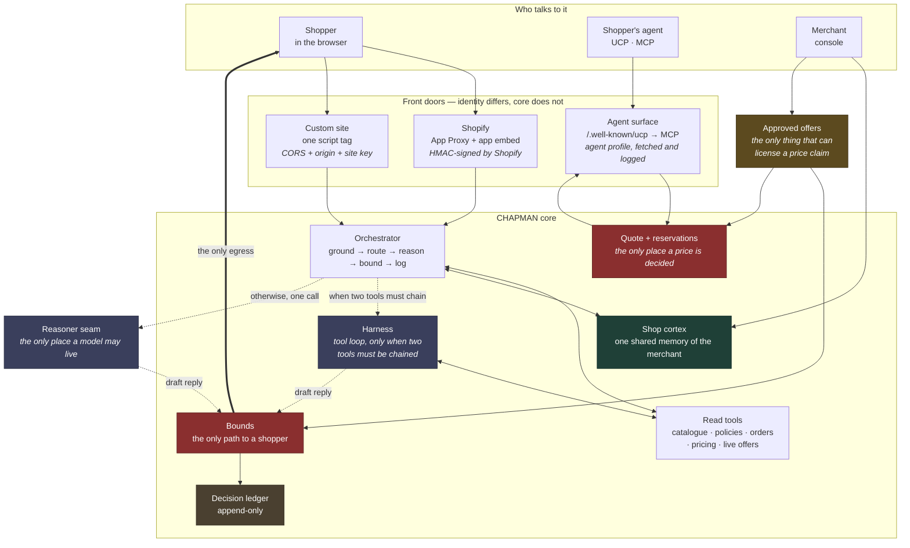
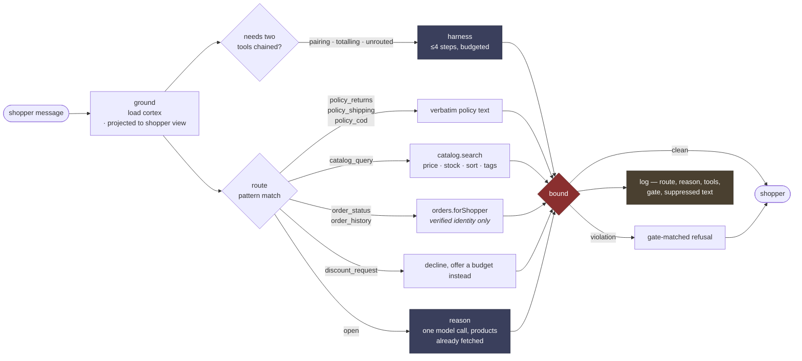
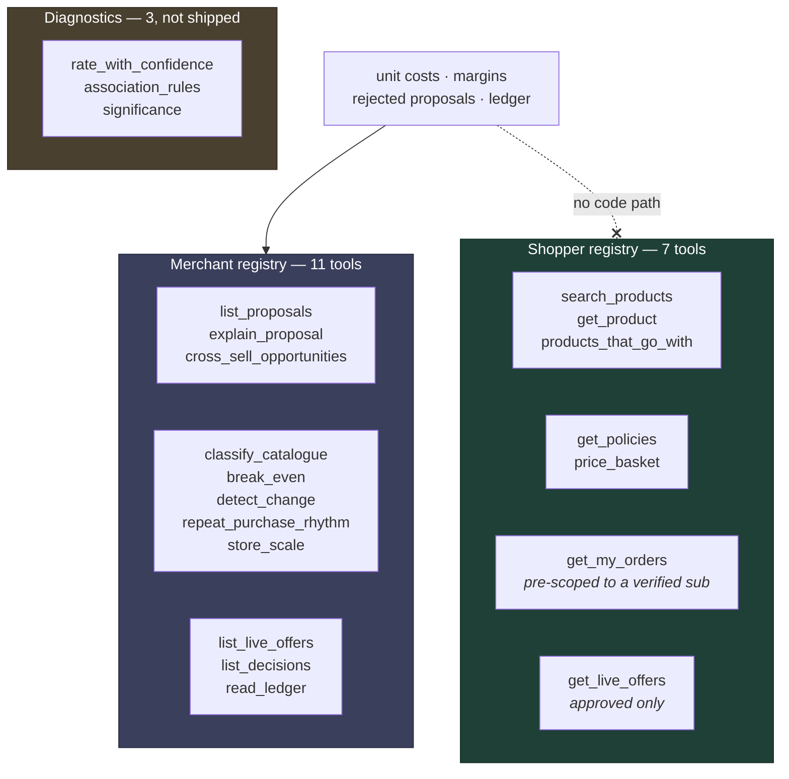
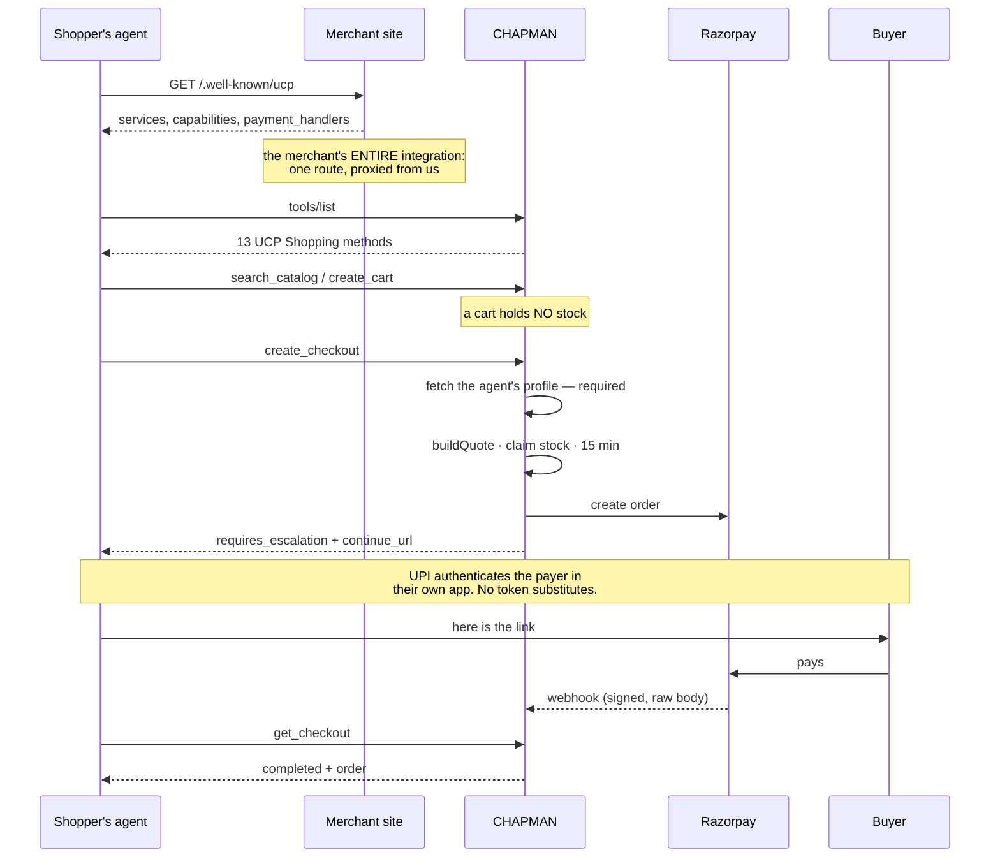
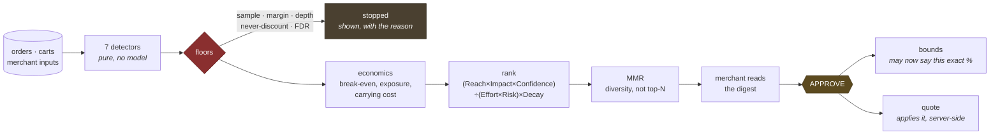

# CHAPMAN

A merchant-side agent gateway. Two front doors over one core.

1. **An agent-readable storefront.** When a shopper's AI agent reaches a merchant's site, it gets a machine surface it can transact against instead of scraping HTML and guessing. It speaks **UCP 2026-08-25** — the same protocol every Shopify store already serves — so an agent that has never heard of us can find, price and buy from a custom store.
2. **A bounded shopping assistant.** An in-page assistant for humans that reasons, cross-sells and surfaces real offers — and is *structurally* unable to invent a discount, a deadline, or a scarcity claim.

Both run on the same catalogue reads, the same pricing, the same guardrails, and the same audit log. If an agent could get a different price from a person, one of the two surfaces would be lying and we would have no way to know which.

---

## The rule the architecture is built around

> **Reads are tools. Speech and money are chokepoints.**

A model may call reads freely, in any order, as often as it likes. It never calls the things that talk to a shopper or move money — its output *passes through* them.

Which produces the claim the whole project rests on:

> **A bound that lives inside the reasoner is not a bound.**

If `check_bounds` were a tool the model *chose* to call, a model having a bad day would skip it. So it is not a tool. The shopper is downstream of the bounds check and there is no other path to them. That is enforcement by structure, not by instruction — and you can verify it by reading the repo rather than trusting a prompt.

The same rule, one layer down, governs money:

> **The client sends WHAT. The server decides HOW MUCH.**

A cart line is `{handle, sku, qty}`. There is no field for a price anywhere — in the widget, in the checkout, or in the agent protocol — so there is no code path that could trust one. When UCP's own schema turned out to mark `totals` and `currency` as `ucp_request: "omit"`, it was the same rule written down by someone else.

---

## High-level design



Two red boxes, and they are the two chokepoints. The reasoner never holds the shopper's connection and never reaches the quote; it returns text, and what happens to that text is not its decision.

---

## The orchestrator, per message

The largest efficiency lever in a storefront assistant is not which model you pick — it is **how often you invoke one**.



**Route first, reason second.** Every row above except `open` resolves with no model at all. A model is invoked only when the router abstains — and when it is, it arrives with products already in hand rather than spending a round trip asking for them.

A router that guesses is worse than one that abstains, so anything unrecognised becomes `open`.

**Harness third.** The tool loop is reserved for messages where answering genuinely requires composing two tools — where the second call's arguments come out of the first call's results. There are exactly three such shapes, and they are named rather than guessed at:

| Shape | Example | Chain |
|---|---|---|
| **pairing** | *"something to go with masala chai"* | `search_products` → `products_that_go_with` |
| **totalling** | *"what would two of those cost delivered?"* | `search_products` → `price_basket` |
| **unrouted** | the router could not decide at all | its own signal |

Everything else takes the cheap path. Escalating every message would multiply latency and rate-limit burn fourfold to serve the fraction of traffic that needs it.

---

## The tool registries



**Two registries, not one with a permission flag.** A single registry would need a check on every tool asking *"is this caller a merchant?"*, and that check is one forgotten line from handing a storefront visitor the merchant's unit costs — which are their negotiating position, not a product attribute. Two disjoint registries make the separation structural. Same reasoning that keeps the shop cortex and a shopper's memory in different stores.

**Every tool in both registries is a read.** There is no `checkout.start`, no `approve_offer`, no `publish`, no `refund`. Not an oversight to be filled in later — it is the architecture. A model that can call a tool that moves money is a model you are trusting with money. Approval stays a human clicking a button with an exposure cap in front of them.

Because the registry is data, it can be printed. The console shows a merchant the complete list of what the assistant is able to do, which is a much stronger assurance than a paragraph promising it behaves.

**The diagnostics are excluded on purpose.** A tool earns a place if a merchant would ask for it in those words. Nobody says *"give me the Wilson lower bound of 12 out of 29"* — and a model reaching for one is a signal that the deterministic pipeline should already have done that work and put the answer on a page.

### How a tool is called

Text JSON, not the OpenAI `tools` parameter, because the free models that stay up are inconsistent about native function calling. **Every turn must be one of exactly two objects:**

```json
{"tool": "search_products", "args": {"query": "chai", "price_max": 2000}}
{"answer": "We have two green teas — Nilgiri Frost at ₹480 and Cardamom at ₹520."}
```

Anything else is **invalid**, not merely untidy. That distinction is load-bearing: given a plain-prose escape hatch, a reasoning model wrote nine paragraphs of deliberation and never called anything, and no regex separates "thinking out loud" from "answering". Requiring `{"answer": …}` makes the difference machine-checkable, so a monologue is rejected exactly like a malformed call.

Three budgets, each for a different failure: **steps** (a model that keeps calling instead of answering), **wall clock** (a slow model or a hanging tool), and **repeats** (the same call twice, which is the commonest small-model loop and which a step budget punishes far too late).

---

## The agent-readable storefront

We did not invent a format. This speaks **UCP 2026-08-25**, verified live against `allbirds.com` and `gymshark.com` — both serve `/.well-known/ucp` pointing at an MCP endpoint, today.



**A cart holds no stock; a checkout does.** An agent comparing five shops must not be able to freeze inventory at all five.

**Escalation is not a shortfall.** `status: "requires_escalation"` with a `continue_url` is a defined outcome in the protocol, and on Indian rails it is the *only* honest one for the dominant payment method. Advertising a capability we would fail at is the fabrication this codebase exists to avoid.

**Agent identity is a document you must be able to serve.** `meta["ucp-agent"].profile` is fetched and logged. It is not authentication — it proves whoever is calling controls a reachable URL — but it makes every stock hold attributable to a host, which is what a rate limit and an audit need. Reads stay anonymous, because a catalogue is public and refusing to answer protects nothing.

What survives as ours: UCP standardises *transacting* and has no opinion on bounds, the ledger, merchant approval, or Indian payment rails.

---

## The guardrails

Enforced in code, outside the model, where the model cannot argue with them. Every block is written to the ledger with the text that was suppressed.

| Gate | Blocks |
|---|---|
| `unverifiable_discount` | any price reduction with no approved offer behind it |
| `unverifiable_urgency` | deadlines, "hurry", scarcity that no tool returned |
| `unapproved_event` | festive stock claims, "prices go up after" |
| `assumed_observance` | assuming what a shopper celebrates or believes |

A **true** stock number is allowed. If inventory really is 3, *"only 3 left"* is a fact, checked against what the tools returned. One digit different and the verdict flips.

**Streaming does not buy latitude.** Text is not forwarded as it arrives and checked at the end — by then the shopper has read it. The guard holds everything until a sentence completes, runs the full check, and only then releases. Verified at every chunk size from 1 to 500: a gate that depends on how the model happens to chunk is not a gate.

---

## The offer proposer, and the loop that closes

Built. Its governing rule:

> **Anything countable is counted by code.**

A model asked to compute an attach rate over 771 orders returns a plausible number that is wrong, and you cannot tell which one. So deterministic detectors produce candidates with statistics attached, merchant floors filter them **before** any model sees them, and the economics are arithmetic.



**An approval is a licence to SAY, not to apply.** The assistant may state that a 10% offer exists — that exact figure, that product, until that date. The rupees come from `buildQuote`, server-side, and the charge happens at the payment page. So the model still never produces a price, and an assistant that could grant a discount would be one that could be argued into one.

The same sentence is refused, then permitted after one click, then refused again on revocation. Nothing about the assistant changes.

Findings that shaped it, all measured against the fixture:

- **Lift is the wrong default for co-purchase.** Rare pairs that co-occur twice by chance produce enormous lift. Hyper-lift divides by a hypergeometric quantile instead and demotes them.
- **The obvious pattern is the least valuable.** The highest-leverage pair is *already* bought together 42% of the time, so there is no headroom left in it. The surprising pair is where the money is — and that falls out of the arithmetic rather than being asserted.
- **Significance alone is not enough.** A planted trap — *"kettle buyers prefer COD"*, 2 of 3 orders — **passes** Fisher's exact at p = 0.028. It takes a Wilson lower bound, a sample floor, *and* false-discovery-rate control to kill it. None of the traps is special-cased: the detectors find them because they look like real patterns, and the floors are what stop them.
- **A normal-theory CUSUM is wrong for rare binary events.** Standardising a 0/1 outcome at an 11% base rate makes every failure a 2.9σ jump, so *two consecutive failures* clear a decision interval of 4. It raised a false alarm on two ordinary retries and dated a real outage four weeks early. Replaced with the sequential likelihood-ratio form.
- **Regularity must be measured per customer, then pooled.** Pooling every gap first measures the spread *between* people, not whether anyone has a cycle — masala chai came out at CV 0.88 that way and the detector found nothing at all.
- **We cannot estimate price elasticity and will not pretend to.** The store has never changed a price, so elasticity is unidentified, not merely biased. The proposer states the break-even lift and leaves the judgement to the merchant.
- **The most loyal customers are the worst discount target.** A cohort that reorders on a regular cycle is the definition of "sure things". Send a reminder — it costs nothing and does the same work.

Three lanes, because they are three different kinds of thing:

| Lane | Contains | Cadence | Margin cost |
|---|---|---|---|
| **Incidents** | payment-failure step changes, A-item stockouts, deep cover | immediate, not ranked | none |
| **Margin-safe actions** | cross-sell placement, replenishment reminders, cart outreach | weekly, ranked | zero |
| **Price experiments** | anything that gives up margin | one at a time, its own gate | bounded by a cap |

A payment outage is not an offer proposal. Putting it in a weekly ranked digest next to *"consider pairing these two teas"* is a category error, so the lanes are separate and only lane A is ranked.

---

## The model layer

`pickReasoner()` is the seam. With no key configured it returns the deterministic reasoner and the product still works — which is why a bad reply, once a model is wired, is unambiguously the model's.

**A chain per job, not a model per job.** Measured, not assumed: `npm run probe:models` asked twelve free models to say one word and **six were down**, rate-limited upstream, on a quiet afternoon. A single model id as a default means the assistant is broken half the time for reasons nobody can see.

| Job | What it actually is | Chain head |
|---|---|---|
| **assistant** | grounded rewriting; a human is waiting | `gemma-4-26b-a4b-it` |
| **analyst** | weekly, unwatched, read by a merchant before they act | `gemma-4-26b-a4b-it` |
| **grader** | binary classification | `gemma-4-26b-a4b-it` |

Instruct models lead every chain, including the analyst's — even though that job most rewards reasoning. A reasoning model cannot drive a tool loop, and two of the fast ones leak their chain of thought straight into `content`. Structured output demotes that from ugly to invalid; an instruct model gets there first and for a fraction of the tokens.

Underneath everything: `withFallback` puts the deterministic reasoner beneath the model, and the widget puts a readable apology beneath that. A free tier *will* hit its cap mid-demo, and a shopper who gets a plainer true answer has had a worse experience — one who gets an error has had none.

---

## Identity, order access and money

Three credential classes, deliberately kept apart. One module serving all three is how one quietly stands in for another.

| | Public? | Proves |
|---|---|---|
| **site key** | yes, sits in the merchant's HTML | which storefront this is |
| **site secret** | no, server-side only | signs shopper session tokens and our requests to the merchant's order feed |
| **merchant login** | no, scrypt + signed cookie | a human may administer this shop |

Order access is **off by default** and needs the merchant to connect a source, because turning it on changes what the assistant can say about a *person*. Every lookup takes a `sub` that came from a signed session and nothing else — there is no lookup by email, by phone, or by order number, because an order number is printed on a receipt and shared in screenshots.

Money has one settlement path, `settlePayment`, called by the browser, by Razorpay's webhook and by UCP's `complete_checkout`. Idempotent on the gateway order id: whichever report arrives first creates the order, the rest change nothing. Stock is held synchronously at checkout, with no `await` between checking availability and taking it — that gap is exactly where a second buyer gets sold the same last unit.

---

## Repo layout

```
agent-gateway/          the gateway — React Router v7 + Vite, Shopify app template
  app/lib/              the core, all framework-free and unit-testable
    assistant.server.ts   the pipeline: ground → route → [harness] → reason → bound → log
    router.server.ts      intent routing — route first, reason second
    harness.server.ts     the tool loop, its protocol and its three budgets
    tools.server.ts       SHOPPER registry — every entry a read
    merchanttools.server.ts  MERCHANT registry, plus the diagnostics it excludes
    reasoner.server.ts    THE MODEL SEAM. pickReasoner() is the one line to change
    openrouter.server.ts  model chains, streaming, fallback, reasoning suppression
    bounds.server.ts      the guardrails, incl. the streaming guard
    approvals.server.ts   the keystone — the only thing that can license a price claim
    quote.server.ts       the money chokepoint. no field accepts a price
    reservations.server.ts  synchronous stock holds
    razorpay.server.ts    orders, signatures, webhooks — secrets by NAME, never value
    settle.server.ts      one settlement path for three report sources
    orderstore.server.ts  orders CHAPMAN placed; idempotent on the gateway order id
    orders.server.ts      the merchant's own history, scoped at the source
    ucp.server.ts         UCP wire types, money, identity, discovery
    ucpmethods.server.ts  the 13 Shopping methods, over the same core
    ucptools.server.ts    what tools/list returns
    stats.server.ts       Wilson · hypergeometric · Fisher · hyper-lift · BH · CUSUM
    detectors.server.ts   7 detectors, pure
    floors.server.ts      merchant floors + false-discovery guard, BEFORE the model
    economics.server.ts   break-even and exposure. never a forecast
    rank.server.ts        RICE + risk + decay, then MMR
    proposals.server.ts   the pipeline end to end
    cortex.server.ts      the shop cortex and its two projections
    identity.server.ts    shopper identity — signed tokens, never a typed identifier
    auth.server.ts        merchant console login — a separate credential class
    calendar.server.ts    Indian festival dates as data, never as a trigger
    testbench.server.ts   readiness probes and the guardrail scenarios
    ledger.server.ts      append-only decision log
  app/routes/           embed.js widget, chat + checkout endpoints, UCP MCP,
                        hosted payment page, and the merchant console
  scripts/
    seed-history.mjs      the deterministic fixture — signals and traps
    check-*.mjs           twelve assertion suites (`npm run check`)
    probe-*.mjs           live measurements: models, UCP end to end, the analyst
    merchant-add.mjs      create a console account
demo-store/             Nilgiri Post — a custom merchant site, Go, no build step
  ucp.go                the merchant's ENTIRE agent integration: one well-known route
  accounts.go           the merchant's half of order access: mint a token, serve a signed feed
```

---

## Running it

No Shopify account is needed. The custom-site path — widget, agent front, console, payments — runs entirely locally.

```bash
# 1. the gateway
cd agent-gateway
npm install
cp .env.example .env.embed        # placeholders are fine; see the file
npm run seed                      # deterministic synthetic history
npm run dev:gateway               # vite --port 3000 --strictPort --mode embed
```

`--mode embed` is not optional. Vite only reads `.env.<mode>`, and without it the app fails with *"Detected an empty appUrl configuration"* — an error that says nothing about the actual cause.

```bash
# 2. a merchant account for the console (there is no sign-up page)
npm run merchant:add -- --email dev@nilgiripost.example --name "Nilgiri Post" \
                        --sites pk_nilgiripost_dev --password chapman-dev

# 3. the demo storefront, in another terminal
cd demo-store
go run . -agent http://localhost:3000
```

- storefront → <http://127.0.0.1:4000>
- merchant console → <http://localhost:3000/dashboard>

`data/` is gitignored — it holds generated fixtures, the merchant table and the session secret — so steps 1 and 2 are required on a fresh clone, not optional.

**To wire a model** (optional; everything works without one): put `OPENROUTER_API_KEY` in the repo-root `.env` and restart. `npm run probe:models` shows which free models are answering right now.

### Walkthrough

**1. The assistant** — open the storefront and click the bubble, bottom right.

| Type this | Expect |
|---|---|
| `any coffee under 700?` | price filter, with product cards |
| `do you have cold brew in stock` | **"only 3 left" — allowed, because it is true** |
| `do you do cash on delivery` | the COD policy, word for word |
| `can i get a discount` | declines, offers to work to a budget instead |
| `what would two cupping sets cost me delivered?` | **the harness** — watch it chain `search` → `price_basket`. The total is the server's, not the model's |

**2. The guardrails.** `echo:` returns text verbatim, so a gate can be *watched* firing instead of taken on trust — the same path a model's output takes.

| Type this | Gate |
|---|---|
| `echo: only 2 left, hurry!` | `unverifiable_urgency` — one digit different from the line above, opposite verdict |
| `echo: Take 20% off today.` | `unverifiable_discount` |
| `echo: Festive stock is limited.` | `unapproved_event` |
| `echo: As a Hindu you'll want the kettle.` | `assumed_observance` |
| `echo: We stock great teas. Take 20% off today.` | **watch this one.** The first sentence appears, then the whole bubble is replaced. The discount sentence never left the server |

**3. Order access.** Click **Account**, sign in as `farhan8@example.invalid` (no password — it is a fixture), then ask `where is my order`. Sign out and ask again: it declines, and notice it does not ask for your email, because an address a stranger can type is not an identity.

**4. The merchant console** — sign in as `dev@nilgiripost.example` / `chapman-dev`.

| Page | What to do |
|---|---|
| **Offers** | the digest, the incidents, and **what was stopped and why** |
| **Analyst** | click a suggestion; read the transcript — every number traces to a tool call |
| **Test bench** | hit *Run*: 7 attacks and 3 controls against the live assistant |
| **Agent front** | a live check of whether your `/.well-known/ucp` is actually serving |
| **Cortex** | what CHAPMAN knows, split into what the assistant may see and what only you may |
| **Ledger** | every gate you fired in step 2, with the suppressed text |

**5. The full loop** — the demo worth showing:

1. Storefront: *"is there 10% off the masala chai?"* → **refused**
2. Console → Offers → approve a 10% experiment
3. Same question → **answered**, and a quote shows ₹68 off ₹680, applied server-side
4. Offers → *Stop this offer* → **refused again**, price back to ₹740

One click is the entire difference. The assistant never changed.

**6. The agent front** — `npm run probe:ucp` walks the whole journey: discovery on the merchant's own origin, `tools/list`, search, cart, a checkout that refuses without an agent profile, then one that opens with a real Razorpay order and a payment link.

### Installing it on a real store

**Custom site** — one tag for the assistant:

```html
<script src="https://your-gateway/embed.js"
        data-site="pk_yourstore"
        data-greeting="Ask me about our teas and coffees."
        data-accent="#1f4037"
        defer></script>
```

…and one route for the agent front, proxying the document we serve for you:

```go
http.HandleFunc("/.well-known/ucp", func(w http.ResponseWriter, r *http.Request) {
    res, err := http.Get("https://your-gateway/ucp/pk_yourstore/profile")
    if err != nil { http.Error(w, "discovery unavailable", 502); return }
    defer res.Body.Close()
    w.Header().Set("Content-Type", "application/json")
    io.Copy(w, res.Body)
})
```

It has to be *your* domain: an agent told to shop at your store looks there and nowhere else. Which also means you revoke us by deleting one route.

**Shopify** — install the app, then turn on the app embed in *Online Store → Themes → Customise → App embeds*. No theme code is edited. Shopify requires the merchant to flip that switch themselves, which is why the honest claim is "one toggle", not "zero". **You do not need the agent front from us** — Shopify already serves UCP on every store.

---

## Tests

```bash
cd agent-gateway && npm run check
```

**312 assertions across twelve suites.** They are adversarial where it matters — each identity check tries to read somebody else's orders and asserts that it could not.

| Suite | Asserts |
|---|---|
| `check-history` | the fixture still contains every planted signal and every trap |
| `check-seasonal` | an approved event licenses a deadline and *nothing* else |
| `check-cortex` | no real unit cost, floor or volume crosses into the shopper projection |
| `check-identity` | forged, expired, cross-site and cross-customer access all fail |
| `check-auth` | corrupt password rows fail closed; sessions cannot be re-subjected |
| `check-streaming` | the offending sentence is never released, at any chunk size — plus the widget's own failure handling |
| `check-payments` | amounts, signatures and minor-unit conversion |
| `check-settlement` | overselling, double-settling and forged webhooks all fail |
| `check-proposals` | the traps are **found** and then **stopped**; each floor tested by removing it |
| `check-approvals` | the same sentence refused → permitted → refused again |
| `check-harness` | the call parser, and that every shopper tool is a read |
| `check-ucp` | money, identifiers, what is published, and every checkout guard |

The fixture is deterministic — same seed, same bytes — so a change in output means the code changed, not the dice.

Live probes, which need the servers running: `probe:ucp`, `probe:models`, `probe:model`, `probe:analyst`.

---

## Status

| | |
|---|---|
| ✅ | Shopify + custom-site transport, catalogue grounding, routing, bounds, ledger |
| ✅ | Shop cortex with enforced projections; merchant console; festival calendar |
| ✅ | Signed shopper identity and scoped order access, end to end |
| ✅ | Streaming replies, with bounds enforced *before* release |
| ✅ | Merchant console login — scrypt, signed session cookie, per-merchant scoping |
| ✅ | Razorpay: orders, signature-verified confirmation, signed webhook, stock holds, idempotent settlement |
| ✅ | **Agent-readable storefront** — UCP 2026-08-25, 13 methods over MCP, end to end |
| ✅ | **Offer proposer** — 7 detectors, three floors, FDR guard, ranking, MMR selection |
| ✅ | **Approvals** — the only thing that can license a price claim, applied server-side |
| ✅ | **Tool harness** — two registries, structured protocol, three budgets |
| ✅ | Model layer with per-job chains and a deterministic floor under everything |
| ✅ | Test bench and readiness probes, merchant-facing |
| ⚠️ | **No rate limiting.** The site key is public by design, `Origin` only binds browsers, and the MCP endpoint is public. A real bill now that a model is wired |
| ⚠️ | Ledger, site registry, approvals and cortex still live in files and memory, not Prisma |
| ⚠️ | The `ucp` CLI requires HTTPS, so third-party client verification needs a tunnel |
| 📋 | Shopper memory, voice outreach, cortex ← proposer wiring, Shopify key set 2 |

---

<sub>Also in this repo: `claimsBench/` and `static/` — an earlier Razorpay agentic-payments test bench, whose findings about capability discovery, error envelopes and the limits of `token.max_amount` shaped several of the design rules above.</sub>
