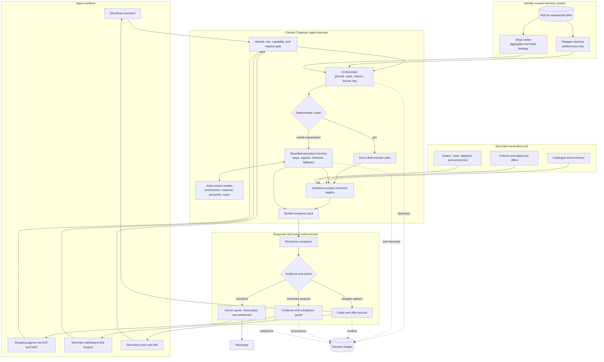
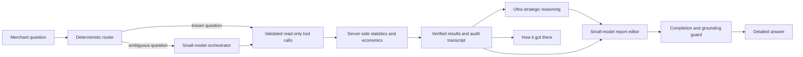

<div align="center">

# CHAPMAN


https://github.com/user-attachments/assets/49c6c457-5a7a-47f6-9573-940e4330e5f1


**A self-hosted merchant-side gateway for AI-assisted shopping.**

One core for the storefront assistant, shopping agents, merchant decisions,
and payments.

**[▶ Watch the 5-minute Chapman pitch](brag-output/chapman-pitch/renders/chapman-final-v2.mp4)**

[15-minute setup walkthrough](https://drive.google.com/file/d/1Uvb2gMqPKDCaVwc28e_lvMf4zaGmcAYM/view?usp=drive_link) ·
[Video Vault](https://drive.google.com/drive/folders/17hVm17-Eo4X1wZzHwMSm7ZlFp-W99Hz9?usp=sharing) ·
[Quickstart](#run-the-docker-demo) · [Fresh setup](docs/fresh-store-setup.md) ·
[Architecture](#architecture) · [Features](#main-features) ·
[Install](INSTALL.md) · [What broke @2am](#what-broke-2am)

</div>

---

## Start here: the 15-minute walkthrough

> **[Watch the 15-minute video](https://drive.google.com/file/d/1Uvb2gMqPKDCaVwc28e_lvMf4zaGmcAYM/view?usp=drive_link)**
>
> That video is all you need to get Chapman up and running against an
> already-hosted website. It goes from a live storefront with no Chapman code in
> it to a working install: registering the store, pasting the assistant script
> tag, adding the agent-discovery route, and verifying each step. Everything
> below is the written reference for the same path.

## What this is

Chapman adds two interfaces to a merchant's store:

- a chat assistant for shoppers;
- an agent-readable API for catalogue search, carts, checkout, orders, and
  offers.

Both interfaces use the same catalogue, prices, approvals, and safety checks.
Models can help write responses, but server code controls claims, permissions,
and payments.

This is a student buildathon project. The custom storefront demo can be run
locally and tested end to end. The current limitations are listed below.

Chapman is designed to fit into different custom storefront stacks with a
small embed and optional server routes. For this demo and initial release,
Razorpay is an explicit prerequisite: the merchant is assumed to already have
Razorpay Checkout integrated on the website and to have registered the payment
webhook. Chapman links the server-side key names and uses that existing payment
setup; it does not create the Razorpay account, complete KYC, enable payment
methods, or register the webhook for the merchant.

## Main features

| Feature                                                                                     | Purpose                                                                                                            |
| ------------------------------------------------------------------------------------------- | ------------------------------------------------------------------------------------------------------------------ |
| [Storefront assistant](docs/architecture.md#storefront-assistant)                           | Answers from the merchant's live catalogue and policies                                                            |
| [Agent front](docs/architecture.md#agent-front)                                             | Publishes UCP over MCP for shopping agents                                                                         |
| [Feature controls](docs/architecture.md#feature-controls)                                   | Lets the merchant withdraw specific capabilities                                                                   |
| [Razorpay checkout](docs/architecture.md#razorpay-checkout-and-settlement)                  | Creates orders and verifies payment settlement                                                                     |
| [Offers](docs/architecture.md#offers-and-approvals)                                         | Requires merchant approval before a promotion can be claimed or applied                                            |
| [Recovery](docs/architecture.md#recovery-and-voice)                                         | Learns why carts were left, applies bounded remedies, and can send a discounted payment link after a Hinglish call |
| [Shopper memory](docs/architecture.md#shopper-memory)                                       | Stores limited preferences for signed-in shoppers                                                                  |
| [Shop cortex](docs/architecture.md#shop-cortex) and [Analyst](docs/architecture.md#analyst) | Provides merchant-side context and read-only analysis                                                              |
| [Decision ledger and Test bench](docs/architecture.md#decision-ledger-and-test-bench)       | Records decisions and tests live guardrails                                                                        |

The bundled storefront is **Monsoon Market**. It is a small Go application used
only to demonstrate the integration.

## Architecture



Chapman is one centralized agent harness behind several specialized agents and
channels. The orchestrator assembles identity-scoped context, chooses a direct
deterministic route or the bounded model/tool harness, and produces a verified
evidence pack. Shopper memory and the merchant cortex share infrastructure but
remain deliberately isolated projections. The final response then passes
through the guard for its audience: claim bounds for shoppers, evidence and
completion checks for merchant analysis, or server-side quote and settlement
logic for commerce. Model output therefore never reaches a shopper directly
and never decides a price. Every decision, tool result, guard verdict, and
settlement transition leaves an inspectable trail.

See [docs/architecture.md](docs/architecture.md) for the deeper execution model
and per-feature diagrams.

### The layered analyst

The Analyst is not one large model improvising over raw orders. Its design is
the project's analytics breakthrough:

> **Code establishes truth. Ultra finds the strategy. A small model explains it.**



Common questions about growth, campaigns, retention, concentration, payment
incidents, and cross-sells are routed deterministically. Only an unmatched
question asks a small, fast model to select from Chapman's read-only merchant
tool registry. Every proposed call is parsed and validated; unknown, malformed,
or repeated calls are rejected, and step, repeat, and wall-clock budgets bound
the loop. The current transport is a strict JSON call shape rather than
OpenRouter's native `tools`/`tool_calls` protocol, but the tool itself is real
server-side TypeScript code—not model role-play.

The tools count customers, compare equal periods, calculate revenue and margin,
measure retention and concentration, and attach sample sizes and caveats. The
Ultra reasoning model sees only those verified results, never the database and
never control of a tool. A smaller report editor receives the same evidence and
turns the strategy into a coherent merchant brief without doing new arithmetic.
Incomplete generations, private planning, invalid JSON, and answers cut off
mid-sentence are rejected; Chapman falls back to the verified evidence instead
of displaying them. The dashboard exposes the executed calls under **How it
got there**, so the impressive answer remains auditable.

Try the complete seeded showcase question:

> How many customers did we have in the past month compared with previous
> months? Revenue this month looks stale—what are the three highest-impact
> actions I should take now, and what evidence supports each one?

## Run the Docker demo

Requirements:

- Docker Desktop with Docker Compose;
- Node.js `>=22.12` to generate the clean demo store;
- ports `3000` and `4000` available.

From the repository root:

```bash
cd agent-gateway
npm install
npm run demo:clean-store
cd ..
docker compose --profile demo up -d --build
docker compose logs gateway
```

If the root `.env` does not exist, copy `.env.docker.example` to `.env` first.
Do not overwrite an existing `.env`.

Open:

- storefront: <http://localhost:4000>
- merchant login: <http://localhost:3000/login>

The gateway log prints a merchant email and password on the first boot.

### Confirm the initial state

The storefront should have no assistant bubble. This should return 404:

```bash
curl -i http://localhost:4000/.well-known/ucp
```

Chapman starts with no registered storefront. It does not load the catalogue or
claim an integration is installed before the merchant configures it.

### Register Monsoon Market

Sign in and select **Configure your storefront**.

| Field                | Value                            |
| -------------------- | -------------------------------- |
| Store name           | `Monsoon Market`                 |
| Public site key      | `pk_monsoon_market`              |
| Browser origin       | `http://localhost:4000`          |
| Catalogue URL        | `http://store:4000/catalog.json` |
| Product URL template | `/product.html?handle={handle}`  |
| Order feed           | leave blank                      |

Select **Configure Razorpay for this storefront** only if shopping agents should
also receive Chapman's hosted checkout. Saving registers the store and creates
its signing secret. It does not install the assistant or agent discovery route.

Monsoon Market already owns its Razorpay Checkout integration. Put
`RAZORPAY_KEY_ID` and `RAZORPAY_KEY_SECRET` in `.env` before starting Docker;
its cart, server-priced quote, Razorpay test-order creation and browser payment
confirmation then work before Chapman is registered or installed. The Assistant
bubble and agent discovery remain absent until their own setup steps.

### Install the storefront interfaces

1. Open **Assistant** and paste its generated script tag before `</body>` in
   `demo-store-clean/index.html`, `product.html`, and `account.html`. A real
   site should put it in its shared layout.
2. Refresh the storefront. No rebuild is needed.
3. Open **Agent front** and review the generated discovery instructions.
4. For the bundled demo, set `DEMO_STORE_CHAPMAN=true` in `.env` and run:

   ```bash
   docker compose --profile demo up -d store
   ```

5. Use **Verify install** on Agent front.

A real storefront can download and host the generated extensionless
`/.well-known/ucp` JSON document, or add the generated redirect/proxy rule for
an always-current copy. `DEMO_STORE_CHAPMAN` is only for the bundled demo.

## Configure provider keys

Provider secrets go in the root `.env`, never in storefront code or SQLite
configuration rows. Apply changes with:

```bash
docker compose up -d gateway
```

| Page           | Required configuration                                                                                            |
| -------------- | ----------------------------------------------------------------------------------------------------------------- |
| Assistant      | `OPENROUTER_API_KEY` is optional; the safe fallback works without it                                              |
| Agent front    | Razorpay needs `RAZORPAY_KEY_ID` and `RAZORPAY_KEY_SECRET`                                                        |
| Analyst        | `OPENROUTER_API_KEY` is required; keys 2 and 3 are optional, consented account lanes for orchestration/presentation failover |
| Shopper memory | OpenRouter summarisation is optional                                                                              |
| Recovery       | Voice needs Sarvam, Twilio SID, Twilio token, Twilio number, and `PUBLIC_ORIGIN`; SMS may reuse the Twilio number |

Each feature page shows its exact variables and whether they are configured.
If the setup checkbox was skipped, use the tested terminal linker documented in
[fresh storefront setup](docs/fresh-store-setup.md#6-razorpay-checkout).

See [docs/configuration.md](docs/configuration.md) for the complete key matrix,
webhook setup, tunnel setup, and model overrides.

## Test the setup

- **Assistant** has **Test chat assistant**. It runs the real assistant pipeline
  against the live catalogue and shows tools, routing, products, and blocked
  checks.
- **Recovery** has **Place test call**. It requires an E.164 number and consent.
  This is a real Twilio call and can use provider credit. An inline console
  shows validation, Sarvam rendering, Twilio acceptance, or the exact reason
  the call was stopped.
- **Recovery** also has **Send test message**. A Full Twilio account receives
  Chapman's fixed neutral text; a Trial account automatically uses Twilio's
  predefined `sms_customer_support` template. The console shows Twilio
  acceptance, and neither path creates a cart, discount, or payment order.

For automated recovery, choose conversational calls and configure the recovery
discount policy. Chapman classifies the caller's first durable answer and
evaluates the returning-customer, margin, quantity, expiry, and monthly-budget
gates used by web recovery. The model cannot choose or negotiate the
percentage.

On a Trial account, a completed call that announced a real grant sends Twilio's
predefined template once to `TWILIO_TEST_TO`; it never claims that template is
a unique payment link. A Full account can additionally enable **Send an
approved discounted-payment link by SMS**, which creates the discounted
Razorpay order and sends its payment page to the number on the call.

Run the automated checks with:

```bash
docker compose run --rm gateway npm run doctor
docker compose run --rm gateway npm run check
```

## Install with a coding agent

Paste this into a coding agent while its workspace is the repository root:

```text
Install and verify Chapman with Docker. Read README.md, INSTALL.md,
docs/configuration.md, .env.docker.example, docs/storefront-host.env.example,
docker-compose.yml, and applicable AGENTS.md first. Preserve my .env, worktree,
and Docker volume. Keep the first
run unconfigured: do not enable CHAPMAN_AUTO_INIT or CHAPMAN_SEED, load a demo
fixture, invent keys, expose secrets, or run docker compose down -v without my
approval.

Generate and start the clean Monsoon Market demo. Verify that it initially has
no assistant and returns 404 at /.well-known/ucp. Pause for me to confirm the
Configure your storefront form. Then follow the Assistant and Agent front setup
instructions. Ask only for keys needed by features I choose. Do not place a
real call without an E.164 number, an expecting recipient, and my explicit
request. Run doctor and the tests. Report registered, installed,
provider-configured, fallback, and manual states separately without printing
secrets. For a hosted storefront, ensure its server-side environment contains
RAZORPAY_KEY_ID, RAZORPAY_KEY_SECRET, and the same generated
SITE_SECRET_<STORE> name and value as Chapman; on Vercel set them for each used
deployment environment and redeploy.
```

The full prompt is in
[docs/agentic-install.md](docs/agentic-install.md).

## Run without Docker

For a dashboard-first development setup:

```bash
cd agent-gateway
npm install
npm run bootstrap
npm run dev:gateway
```

For command-line storefront setup:

```bash
cd agent-gateway
npm install
npm run init
npm run doctor
npm run dev:gateway
```

See [INSTALL.md](INSTALL.md) for the full native and production setup.

## Project status

The detailed, current implementation and roadmap are tracked in the
[feature checklist](docs/feature-checklist.md). The active milestone is a
dependable Docker self-hosted gateway; the hosted control-plane split is
deliberately deferred.

Implemented:

- clean first-store onboarding;
- custom storefront assistant and agent discovery;
- catalogue grounding, approvals, and server-side claim checks;
- Razorpay checkout and settlement verification;
- recovery, voice, shopper memory, analyst, cortex, ledger, and test bench;
- a layered merchant analyst with deterministic/small-model orchestration,
  verified statistical tools, Ultra reasoning, a smaller report editor,
  truncation guards, and an inspectable tool transcript;
- Docker setup, persistent data, doctor, and automated tests;
- authoritative SQLite state, versioned startup migrations, explicit health
  routes, and verified backup/restore commands;
- structured request logging plus streaming-safe body limits and per-client
  rate limits across the public chat, agent, identity, payment, recovery,
  voice, and webhook routes;
- bounded graceful shutdown that drains active HTTP/background work before
  disconnecting Prisma and checkpointing/closing SQLite.

Current limitations:

- in-flight inventory reservations are still process-local;
- public rate limits are process-local and therefore assume the current
  single-gateway deployment; a multi-replica deployment will need a shared
  limiter;
- general WhatsApp and email outreach are not implemented; production Indian
  SMS still requires DLT registration, while the controlled Twilio SMS handoff
  already works;
- shopper-memory search is lexical rather than semantic;
- production deployment still requires HTTPS, off-host backups, secret management, and
  normal server hardening.

## Future direction

The current Docker build intentionally ships the merchant dashboard and the
runtime gateway as one self-hosted application. Once that build is dependable,
the planned next deployment model separates them:

- a Chapman dashboard/control plane that can be hosted independently;
- a merchant-specific gateway/server that can run on the merchant's own
  container host and domain, independently of both the dashboard and the
  storefront;
- signed, versioned configuration between the two, with revocation and key
  rotation, while shopper data remains in the merchant gateway by default;
- continued support for the fully standalone Docker build, so the hosted
  dashboard never becomes mandatory.

This lets a Vercel-hosted storefront remain a normal independent website while
its Chapman gateway runs on a durable container platform such as Railway,
Render, or Fly.io. Serverless gateway deployment will be considered only after
its database and background-work requirements have a production-safe design.

Catalogue ingestion will also grow beyond the current CSV importer and bounded
Schema.org crawler. A future optional [Firecrawl](https://github.com/firecrawl/firecrawl)
integration is planned for JavaScript-rendered and harder-to-parse storefronts.
Firecrawl would acquire pages; Chapman's validator would still normalize the
data, flag missing price/currency/availability fields, require merchant review,
and publish only an explicitly approved catalogue draft. This work is postponed
until the core gateway and real-store integration tests are stable.

## Documentation

| Document                                               | Purpose                                     |
| ------------------------------------------------------ | ------------------------------------------- |
| [docs/feature-checklist.md](docs/feature-checklist.md) | Current state, decisions, and milestones    |
| [INSTALL.md](INSTALL.md)                               | Docker, native, and production installation |
| [docs/configuration.md](docs/configuration.md)         | Provider keys and integration tests         |
| [docs/agentic-install.md](docs/agentic-install.md)     | Full coding-agent setup prompt              |
| [docs/storefront-host.env.example](docs/storefront-host.env.example) | Hosted storefront environment template |
| [docs/architecture.md](docs/architecture.md)           | System and per-feature diagrams             |
| [docs/catalog-format.md](docs/catalog-format.md)       | Catalogue JSON format                       |
| [docs/fresh-store-setup.md](docs/fresh-store-setup.md) | Empty-volume setup for every feature        |
| [docs/demo-plan.md](docs/demo-plan.md)                 | Demo runbook                                |
| [docs/demo-data.md](docs/demo-data.md)                 | Repeatable Monsoon and Fieldnote demo data  |
| [docs/troubleshooting.md](docs/troubleshooting.md)     | Common failures                             |

## What broke @2am

The hardest part was not adding a chat bubble. It was designing an installation
and tool architecture that could fit into an existing independent merchant
website without forcing the merchant to rebuild the store around Chapman.

Independent stores use different frameworks, hosts, product schemas, login
systems, and checkout flows. Requiring a specific database, JavaScript
framework, product platform, or page structure would make the integration easy
for Chapman and expensive for the merchant.

We reduced the required contract to a few things:

- one public JSON catalogue feed;
- the exact browser origin of the storefront;
- one script tag for the assistant;
- one redirect or proxy route for agent discovery.

Payments, order access, memory, recovery, and voice are optional layers. A store
can add them later without replacing its existing storefront or checkout.

The second difficult problem was gathering useful data without making shoppers
feel watched or unsafe. Order history, contact details, conversations, and
memory can improve an assistant, but collecting them by default would create a
larger privacy and security problem than the feature solves.

The main design decisions were:

- **The merchant stays the source of truth.** Chapman reads catalogue and policy
  data from the merchant and computes prices on the server. The browser and the
  model cannot submit a price.
- **Integration is progressive.** The assistant, agent discovery, order access,
  Razorpay, and voice are separate steps. Missing optional integrations do not
  break basic catalogue assistance.
- **Registration is not installation.** The dashboard separately reports that a
  store is registered, that storefront code was detected, and that provider
  credentials are ready.
- **Models receive read-only tools.** Text must pass through claim checks, and
  money must pass through the quote and payment services.
- **Identity must be signed.** Personal orders and memory are available only
  through a short-lived merchant-signed shopper session. Typing an email,
  phone number, or order number does not establish identity.
- **The browser cannot choose who gets contacted.** Recovery contact details
  come from a verified merchant source. Test calls require an expecting
  recipient and explicit consent.
- **Memory is limited and first-party.** Shopper memory is isolated by store and
  shopper, can be deleted, and cannot contain prices, stock counts, offers,
  payment details, or order state.
- **Aggregate findings stay aggregate.** The shop cortex receives counts and
  merchant findings, not raw shopper conversations or contact details.
- **The integration is removable.** A merchant can remove the script tag and
  discovery route or disable a capability without rewriting the storefront.

Several implementation failures came from breaking these boundaries. A
preconfigured demo made an uninstalled store look active. Docker `localhost`
addresses worked in the browser but not inside the gateway container. Payment
capabilities looked available when variable names existed but their values did
not. The fixes were to verify real storefront routes, distinguish configuration
from readiness, and test claims against the same live paths a shopper or agent
uses.
