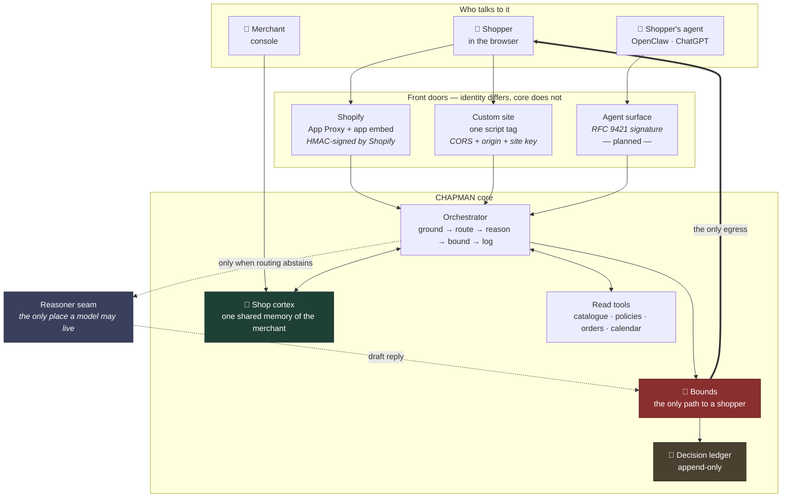
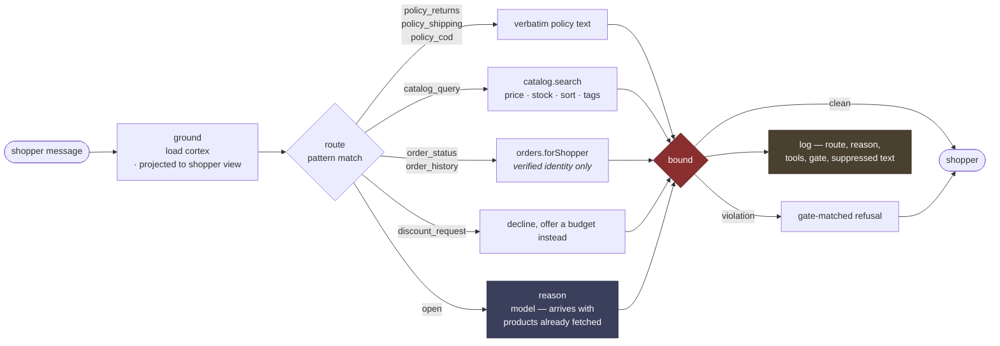
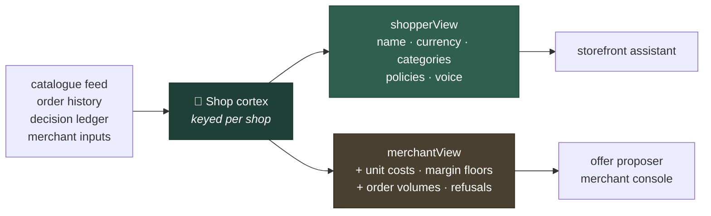
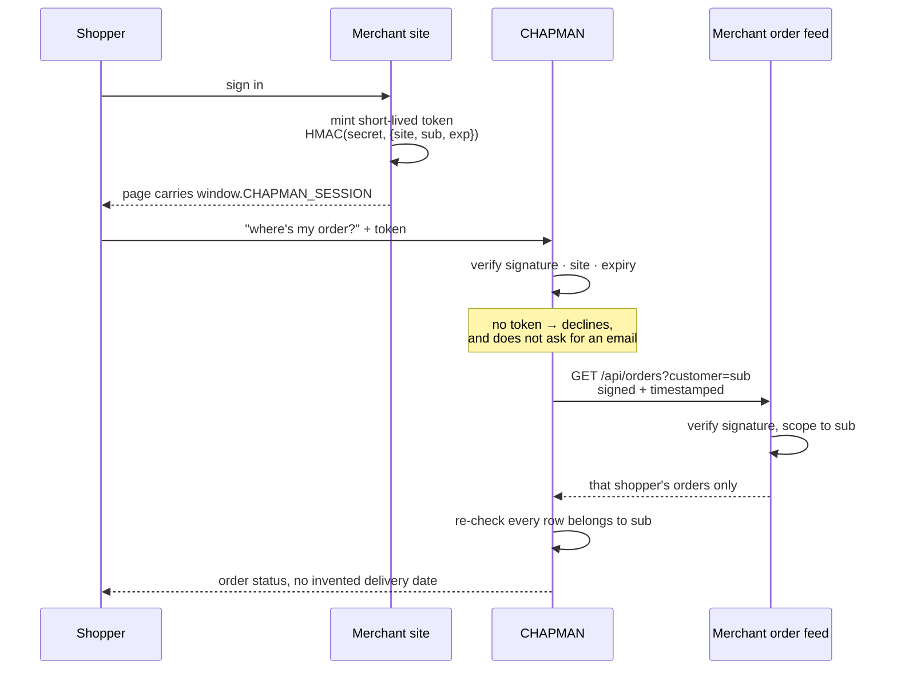

# CHAPMAN

A merchant-side agent gateway. Two front doors over one core.

1. **An agent-readable storefront.** When a shopper's AI agent reaches a merchant's site, it gets routed to a machine surface it can transact against, instead of scraping HTML and guessing.
2. **A bounded shopping assistant.** An in-page assistant for humans that reasons, cross-sells and surfaces real offers — and is *structurally* unable to invent a discount, a deadline, or a scarcity claim.

Both run on the same catalogue reads, the same guardrails, and the same audit log.

---

## The rule the architecture is built around

> **Reads are tools. Speech and money are chokepoints.**

A model may call reads freely, in any order, as often as it likes. It never calls the things that talk to a shopper or move money — its output *passes through* them.

Which produces the claim the whole project rests on:

> **A bound that lives inside the reasoner is not a bound.**

If `check_bounds` were a tool the model *chose* to call, a model having a bad day would skip it. So it is not a tool. The shopper is downstream of the bounds check and there is no other path to them. That is enforcement by structure, not by instruction — and you can verify it by reading the repo rather than trusting a prompt.

---

## High-level design



The reasoner never holds the shopper's connection. It returns text, and what happens to that text is not its decision.

---

## The orchestrator, per message

The largest efficiency lever in a storefront assistant is not which model you pick — it is **how often you invoke one**.



**Route first, reason second.** Every row above except `open` resolves with no model at all. A model is invoked only when the router abstains — and when it is, it arrives with products already in hand rather than spending a round trip asking for them.

A router that guesses is worse than one that abstains, so anything unrecognised becomes `open`.

---

## The guardrails

Enforced in code, outside the model, where the model cannot argue with them. Every block is written to the ledger with the text that was suppressed.

| Gate | Blocks | Passes |
|---|---|---|
| `unverifiable_discount` | "15% off today", "special price just for you" | anything from an approved offer *(none exist yet, so the correct number of offerable discounts is zero)* |
| `unverifiable_urgency` | "only 2 left, hurry", "ends soon" | **"only 3 left" when inventory really is 3** |
| `unapproved_event` | "festive stock is limited", "prices go up after Diwali", "everyone's buying this" | — |
| `assumed_observance` | "As a Hindu you'll want…", "since you're celebrating…" | — |

Two of those deserve a note.

**Grounded scarcity passes.** "Only 3 left" and "only 2 left" are the same sentence shape with opposite verdicts, decided by what the catalogue actually returned. The gate is not a word filter.

**Urgency has exactly one legitimate source.** A merchant may approve a dated event — a real window with a real end date. That makes "our Diwali week ends Sunday" a *fact*. The gate did not get more permissive to allow it; it got something true to check against. An event licenses a **deadline and nothing else**: not a discount, not scarcity, not a claim about other shoppers, and not once it has expired.

---

## The shop cortex

One shared memory of the merchant that every tool reads from, instead of each keeping its own drifting half-view. Assembled from what already exists — catalogue feed, order history, ledger, merchant inputs — so it cannot fall out of step with the truth. Almost all of it is derived; the merchant types only what we genuinely cannot compute.

**Two projections, and the split is the safety property:**



The assistant is not *asked* to keep your margins secret. **It is never handed them.** Tested by taking the real unit costs out of the merchant file and searching the shopper projection for those exact values.

Two further rules:

- **No shopper data, structurally.** No field in `ShopCortex` can carry a person. Shop knowledge is merchant-owned and shared by every tool; knowledge about a person is personal data with its own partitioned store.
- **Keyed per shop.** One person running two shops gets two cortexes with no path between them.

Every fact carries provenance and an expiry — a catalogue snapshot goes stale in a day; a policy the merchant wrote never does.

---

## Identity and order access

Off by default. Turning it on changes what the assistant can say about a *person*.

> **Never look up an order from an identifier the shopper typed.**

"Where's my order? My email is priya@example.com" must not work. Anyone can type anyone's address, and a widget that answers it is a data breach with a friendly tone.



On **Shopify** none of this is needed: `logged_in_customer_id` arrives inside Shopify's own HMAC on the App Proxy request, so verifying the proxy *is* verifying the identity.

On a **custom site** the merchant implements two small things — mint a token on login, answer a signed request for one customer's orders. **We never receive a database credential.** The merchant scopes the query and CHAPMAN re-checks every row on arrival: two independent checks, because a leak here would be a leak of the merchant's customers by the merchant's own code.

Conversation logs run the other way. They are *our* data, so we hold them and the merchant exports them or has them pushed to a bucket they own — asking for write access to production in order to store our own log file is a bad trade for both sides.

---

## The offer proposer

Designed and measured against a fixture; detectors not yet written. Its governing rule:

> **Anything countable is counted by code.**

A model asked to compute an attach rate over 771 orders returns a plausible number that is wrong, and you cannot tell which one. So deterministic detectors produce candidates with statistics attached, merchant floors filter them **before** the model sees them, and the economics are arithmetic. The model selects and writes; it never produces a number that reaches a merchant.

Three lanes, because they are three different kinds of thing:

| Lane | Contains | Cadence | Margin cost |
|---|---|---|---|
| **Incidents** | payment failure clusters, stale feed, A-item stockouts | immediate | none |
| **Margin-safe actions** | cross-sell placement, replenishment reminders, cart outreach | weekly, ranked | zero |
| **Price experiments** | anything that gives up margin | one at a time, holdout required | bounded by a cap |

Findings that shaped it, all measured:

- **Lift is the wrong default for co-purchase.** Rare pairs that co-occur twice by chance produce enormous lift. Hyper-lift divides by a hypergeometric quantile instead and demotes them.
- **The obvious pattern is the least valuable.** Chai and assam co-occur in 169 baskets — and are *already* bought together 42% of the time, so there is no headroom. Worth ₹216/month. The surprising pair is worth ₹814.
- **Significance alone is not enough.** A trap in the fixture — "kettle buyers prefer COD", 2 out of 3 orders — **passes** Fisher's exact test at p = 0.028. It takes a Wilson lower bound, a sample floor, *and* false-discovery-rate control across all the tests we run to kill it.
- **We cannot estimate price elasticity and will not pretend to.** The demo store has never changed a price, so elasticity is unidentified, not merely biased. The proposer states the break-even lift and leaves the judgement to the merchant.
- **Never discount into rising demand.** A festival *is* the demand. Measured: ₹74,870 of gifting revenue arrived because of Raksha Bandhan; 10% off it costs ₹7,487 and buys nothing that was not already coming.
- **The most loyal customers are the worst discount target.** 12 shoppers reorder on a 33-day cycle. A 10% discount hands ₹3,664 to people who were coming back anyway. Send a reminder instead.

---

## Repo layout

```
agent-gateway/          the gateway — React Router v7 + Vite, Shopify app template
  app/lib/              the core, all framework-free and unit-testable
    catalog.server.ts     one CatalogSource, two implementations (Shopify, JSON feed)
    router.server.ts      intent routing — route first, reason second
    reasoner.server.ts    THE MODEL SEAM. pickReasoner() is the one line to change
    bounds.server.ts      the guardrails, and the only path to a shopper
    cortex.server.ts      the shop cortex and its two projections
    identity.server.ts    signed session tokens; never trusts a typed identifier
    orders.server.ts      order access, scoped at the source
    calendar.server.ts    Indian festival dates as data, never as a trigger
    ledger.server.ts      append-only decision log
  app/routes/           embed.js widget, chat endpoints, merchant console
  scripts/              deterministic fixture + adversarial checks
demo-store/             Nilgiri Post — a custom merchant site, Go, no build step
```

---

## Running it

```bash
# 1. the gateway
cd agent-gateway
npm install
npm run seed          # deterministic synthetic history
npx vite --port 3000 --strictPort

# 2. the demo storefront
cd demo-store
go run . -agent http://localhost:3000
```

- storefront → <http://127.0.0.1:4000>
- merchant console → <http://localhost:3000/dashboard>

**To see the whole thing work:** open the storefront, ask *"do you have cold brew in stock"* (grounded scarcity passes), then *"can I get a discount"* (declined), then `echo: only 2 left, hurry!` — the `echo:` prefix returns text verbatim so the gate can be watched firing rather than taken on trust. Then **Account → sign in** and ask *"where's my order?"*; sign out and ask again.

### Installing it on a real store

**Custom site** — one tag, nothing else:

```html
<script src="https://your-gateway/embed.js"
        data-site="pk_yourstore"
        data-greeting="Ask me about our teas and coffees."
        data-accent="#1f4037"
        defer></script>
```

**Shopify** — install the app, then turn on the app embed in *Online Store → Themes → Customise → App embeds*. No theme code is edited. Shopify requires the merchant to flip that switch themselves, which is why the honest claim is "one toggle", not "zero".

---

## Tests

```bash
cd agent-gateway && npm run check
```

50 assertions across four suites. They are adversarial where it matters — each identity check tries to read somebody else's orders and asserts that it could not.

| Suite | Asserts |
|---|---|
| `check-history` | the fixture still contains all five planted signals and all three traps |
| `check-seasonal` | an approved event licenses a deadline and *nothing* else |
| `check-cortex` | no real unit cost, floor or volume crosses into the shopper projection |
| `check-identity` | forged, expired, cross-site and cross-customer access all fail |

The fixture is deterministic — same seed, same bytes — so a change in output means the code changed, not the dice.

---

## Status

| | |
|---|---|
| ✅ | Shopify + custom-site transport, catalogue grounding, routing, bounds, ledger |
| ✅ | Shop cortex with enforced projections; merchant console; festival calendar |
| ✅ | Signed shopper identity and scoped order access, end to end |
| 🚧 | **The reasoner is a deterministic stub.** `pickReasoner()` is the seam; everything else is verified without a model, so when one is wired a bad reply is unambiguously the model's |
| 🚧 | Offer proposer — method designed and measured, detectors not written |
| ⚠️ | **No rate limiting.** The site key is public by design and `Origin` only binds browsers, so any client can replay the widget's request. Harmless on a stub; a real bill the moment a model is wired |
| ⚠️ | The merchant console has no authentication — it reads one development merchant |
| 📋 | Agent-readable front, Razorpay payment path, voice outreach, MCP server |

---

<sub>Also in this repo: `claimsBench/` and `static/` — an earlier Razorpay agentic-payments test bench, whose findings about capability discovery, error envelopes and the limits of `token.max_amount` shaped several of the design rules above.</sub>
