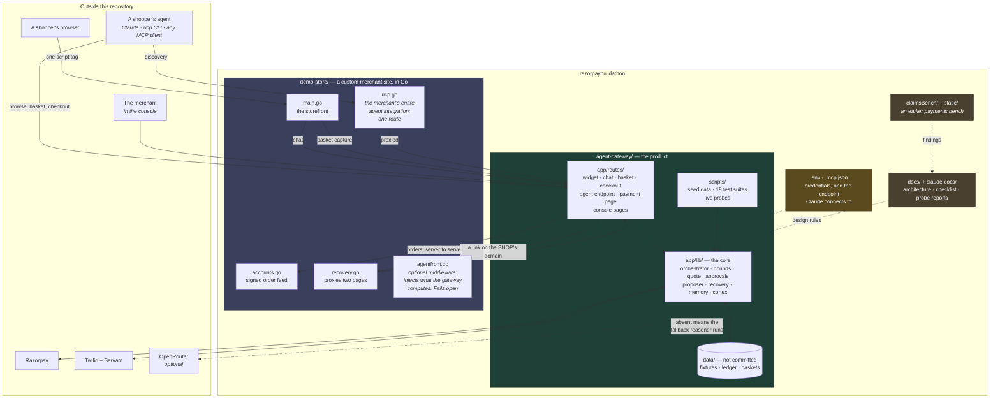
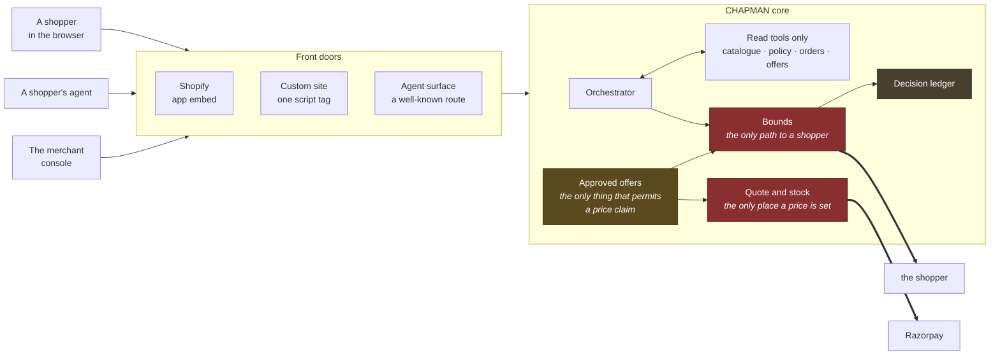
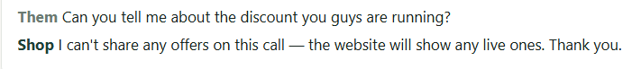

<div align="center">

# CHAPMAN

**A merchant-side agent gateway.**

Two front doors — one for shopping agents, one for people — over a single core that cannot be talked into a claim it cannot back up.

[](#agent-readable-storefront)
[](#2-real-claude-over-mcp)
[](#payments-and-settlement)
[](#tests)

[Quickstart](#quickstart) · [Architecture](#architecture) · [Features](#features) · [For merchants](#for-merchants) · [Tests](#tests) · [Status](#status-and-limits)

</div>

---

## What this is

An AI shopping agent that lands on a merchant's site today has to scrape HTML and guess. A shop assistant widget, meanwhile, will happily invent a discount to close a sale.

CHAPMAN fixes both from the merchant's side, using one core.

| Front door | Who uses it | What it gets |
|---|---|---|
| **Agent-readable storefront** | A shopper's AI agent | A machine surface it can buy through — UCP 2026-08-25 over MCP, the same protocol every Shopify store already serves |
| **Bounded shopping assistant** | A person, in the page | An assistant that answers, cross-sells and shows real offers — and cannot invent a discount, a deadline or a scarcity claim |

Both run on the same catalogue, the same prices, the same guardrails and the same audit log. If an agent could get a different price from a person, one of the two would be lying and nobody could tell which.

**It has been driven end to end by software we did not write.** Shopify's `ucp` command-line client completed discovery against it. Claude, connected over MCP with no adapter, bought two tins of tea: ₹960 less a ₹96 merchant-approved discount plus ₹60 shipping, **₹924 paid**. The only human step was authorising the card.

---

## The three rules

Everything below follows from one of these.

> **1. Reads are tools. Speech and money are chokepoints.**
> A model may look things up freely. It never calls the code that talks to a shopper or moves money — its output *passes through* that code.

> **2. The client sends what. The server decides how much.**
> A basket line is a product, a size and a quantity. No field anywhere accepts a price, so no code can trust one.

> **3. Anything countable is counted by code.**
> A model asked to work out a rate across 771 orders returns a believable number that is wrong, and you cannot tell which one.

---

## Architecture

### The repository

Everything in the project root, and how the pieces connect.



Note how little sits on the merchant's side. `demo-store/` is a complete storefront, and its whole agent integration is `ucp.go` — one route.

| Path | What it is |
|---|---|
| `agent-gateway/` | the product — widget, agent surface, console, payments, recovery, voice |
| `demo-store/` | Nilgiri Post, a fictional merchant. Shows what a real store has to do |
| `docs/` | the architecture document, committed with the code |
| `claude docs/` | working design notes and probe reports. Kept locally, not committed |
| `claimsBench/`, `static/` | an earlier payments test bench, kept for reference |
| `.mcp.json` | declares the endpoint so Claude Code can shop here |
| `.env` | model, Razorpay and voice credentials |

### The core



The two dark red boxes are the chokepoints. The model never holds the shopper's connection and never reaches the quote. It returns text, and what happens to that text is not its decision.

The gold box is the keystone: an approved offer is the only thing that makes a price claim sayable.

Every other diagram — the orchestrator, the tool registries, the offer pipeline, the recovery loop, memory, and the agent checkout — is in [docs/architecture.md](docs/architecture.md).

---

## Quickstart

### Requirements

| | What | Notes |
|---|---|---|
| Required | Node `>=20.19 <22` or `>=22.12` | the gateway |
| Required | Go 1.26 | the demo storefront only |
| Not needed | A database | files and memory today |
| Not needed | A Shopify account | the custom-site path runs entirely locally |
| Optional | `OPENROUTER_API_KEY` | without it a fallback reasoner runs and everything still works |
| Optional | Razorpay test keys | only to take a payment |
| Optional | Sarvam and Twilio keys | voice calls. Without them the channel stays off |

### Running it — about three minutes

```bash
# 1 - the gateway
cd agent-gateway
npm install
cp .env.example .env.embed          # the placeholders are fine
npm run seed                        # deterministic sample history
npm run dev:gateway

# 2 - a console account. There is no sign-up page
npm run merchant:add -- --email dev@nilgiripost.example --name "Nilgiri Post" \
                        --sites pk_nilgiripost_dev --password chapman-dev

# 3 - the demo storefront, in another terminal
cd demo-store
go run . -agent http://localhost:3000
```

Storefront: <http://127.0.0.1:4000> — Console: <http://localhost:3000/dashboard>, signing in as `dev@nilgiripost.example` / `chapman-dev`.

> [!IMPORTANT]
> The dev script sets `--mode embed`, and that matters. Vite only reads `.env.<mode>`, so without it the app fails with *"Detected an empty appUrl configuration"* — an error that says nothing about the real cause. The `data/` folder is not committed, so steps 1 and 2 are required on a fresh clone.

### Five things to try first

Open the storefront and click the bubble in the bottom right.

| Type this | What you should see |
|---|---|
| `any coffee under 700?` | a price filter, with product cards |
| `do you have cold brew in stock` | *"only 3 left"* — allowed, because it is true |
| `echo: only 2 left, hurry!` | blocked. One digit different, and the verdict flips |
| `echo: We stock great teas. Take 20% off today.` | the first sentence appears, then the whole reply is replaced. The discount sentence never left the server |
| `what would two cupping sets cost me delivered?` | two tools chained. The total is the server's, not the model's |

Anything starting with `echo:` is returned word for word through the same path a model's reply takes, so you can watch a guardrail fire instead of taking it on trust. Every block is recorded on the **Ledger** page, along with the text it suppressed.

### The demonstration worth showing

1. On the storefront, ask: *"is there 10% off the masala chai?"* — **refused**
2. In the console, under **Offers**, approve a 10% experiment
3. Ask again — **answered**, and the quote shows ₹68 off ₹680, applied on the server
4. Stop the offer — **refused again**, price back to ₹740

One click is the whole difference. Nothing about the assistant changed.

### Connecting a model (optional)

Put `OPENROUTER_API_KEY` in the `.env` file at the repository root and restart. `npm run probe:models` shows which free models are answering right now.

---

## Pointing a real agent at it

### 1. The scripted shopper

```bash
cd agent-gateway
node scripts/shop-as-agent.mjs --no-checkout   # browse only
node scripts/shop-as-agent.mjs                 # through to a payment link
```

It calls the real endpoint, reads the real offers, builds a priced basket, opens a checkout, prints the payment link, then waits until you have paid. Useful as a diagnostic: when a real agent fails, this tells you which step broke.

### 2. Real Claude, over MCP

The endpoint is MCP over HTTP, so a real assistant can shop here with no adapter and no tunnel. `.mcp.json` already declares it:

```json
{ "mcpServers": { "nilgiri-post": {
    "type": "http",
    "url": "http://[::1]:3000/ucp/pk_nilgiripost_dev/mcp" } } }
```

Start the stack, restart Claude Code, and `/mcp` should list `nilgiri-post`. Then just talk to it: *"what tea do you have under ₹500, is anything on offer, put two in a basket and check out."*

> [!TIP]
> Tell it which agent profile to use, or it will invent a URL that returns a 404:
> *Use `http://localhost:3000/agent/testing/profile` as your `ucp-agent` profile.*

<details>
<summary>Why the address is <code>[::1]</code> and not <code>localhost</code></summary>

Vite binds the IPv6 loopback only, so nothing is listening on `127.0.0.1:3000`. `curl` hides this by trying both, so the endpoint looks fine from a terminal while a client that resolves `localhost` to IPv4 reports "unable to connect" — which reads like a bad URL. Check yours with `netstat -ano | findstr :3000`.

A refused connection almost always means the gateway is not running. Also, run the gateway and the store in your own terminals: a stack started inside an agent session dies when that session ends.

</details>

### 3. Shopify's own client

This is the one that proves the implementation conforms, rather than merely agreeing with itself.

```bash
npm i -g @shopify/ucp-cli
cloudflared tunnel --url http://localhost:3000      # it requires HTTPS
ucp discover https://<your-store> --refresh
```

> [!WARNING]
> A brand-new tunnel hostname often does not resolve on a home router's DNS for a few minutes, and the client reports that as a failed profile fetch — which looks exactly like a broken install. Try `curl` on the same URL first: a status of `000` means DNS, not you.

### Paying, in test mode

Card `4111 1111 1111 1111`, any future expiry, any CVV, one-time password `1234`.

UPI is not available on this account, and the store does not claim otherwise — it needs completed KYC, and until then Razorpay refuses it. So the published methods are card, netbanking and wallet. When KYC clears, one line turns it on everywhere.

---

## Features

Each has its own section below. The honest gaps are under [Status and limits](#status-and-limits).

| Feature | In one line |
|---|---|
| [Agent-readable storefront](#agent-readable-storefront) | fourteen tools over MCP, one line to install |
| [Legibility for models that browse](#legibility-for-models-that-browse) | structured data, an `llms.txt`, and a machine view of every page |
| [Bounded shopping assistant](#bounded-shopping-assistant) | route first, reason second — a model only when one is needed |
| [The guardrails](#the-guardrails) | four checks the model cannot argue with |
| [Two tool registries](#two-tool-registries) | seven shopper reads, fourteen merchant reads, no writes |
| [The offer proposer](#the-offer-proposer) | seven detectors, filters before the model, arithmetic economics |
| [Approvals](#approvals) | the only thing that permits a price claim |
| [Basket recovery](#basket-recovery) | 226 baskets in, twelve out, 214 left alone with a stated reason |
| [Asking why](#asking-why) | twelve labels, and an offer that never improves under pressure |
| [Voice outreach](#voice-outreach) | it rings a real handset and has no figure to concede |
| [Shopper memory](#shopper-memory) | per merchant and shopper, and unable to hold a price |
| [The shop cortex](#the-shop-cortex) | one shared record of the merchant, with enforced views |
| [Live basket capture](#live-basket-capture) | real baskets, priced by the server |
| [Payments and settlement](#payments-and-settlement) | one settlement path for three sources |
| [Identity and order access](#identity-and-order-access) | three kinds of credential, kept apart |
| [The merchant console](#the-merchant-console) | ten pages, including one that attacks the live assistant |
| [The model layer](#the-model-layer) | a shortlist per job, with a fallback under everything |

---

### Agent-readable storefront

A well-known route leads to an endpoint serving the thirteen UCP shopping methods plus one for promotions. Discovery, catalogue, baskets, checkout, a real Razorpay order, and reading the order back afterwards.

Three things a scraper cannot get:

- **A basket holds no stock; a checkout does.** An agent comparing five shops must not be able to freeze inventory at all five.
- **An agent sees the same offers a person does, and cannot invent one.** Approved offers come back as a discount line applied by the same server that will charge for it. The agent surface carries terms — ten per cent off, until the thirteenth — and never an amount, because the amount only exists once a basket does. There is no field an agent can put a discount in.
- **An agent's identity is a document it must be able to serve.** The profile URL is fetched before any stock is held. It is not authentication, but it makes every hold traceable to a host. Reads stay anonymous, because a catalogue is public.

Handing the buyer a payment link is not a shortfall. Razorpay authenticates the payer directly, so no token an agent holds can complete a purchase — we tested the server-to-server API rather than assuming. The protocol has a defined status for exactly this, and on Indian payment rails it is the only honest one.

Verified live against `allbirds.com` and `gymshark.com`, driven by Shopify's own client, and used by Claude to complete a ₹924 order.

*See it:* `npm run probe:ucp`, or the **Agent front** page.

---

### Legibility for models that browse

The section above serves an agent that reads the discovery route, gets an endpoint, and never looks at the merchant's HTML again. This optional second layer serves the other population: someone pastes a product URL into Claude or ChatGPT, and it fetches the page like a browser with no idea the protocol exists. It gets one shot at the HTML.

So this adds nothing transactable — it adds legibility. Structured `Product` and `Offer` data injected into the page, a generated `/llms.txt`, a `Link:` header so a client that *does* speak the protocol can upgrade itself from any page, and the same URL answering with data when asked.

Three properties make it safe to put in front of a live storefront:

- **The merchant's side computes nothing.** It sends us a path and injects what comes back, so there is never a second place prices and offers come from.
- **It publishes the list price and never a discounted one.** An offer rides along as terms, because the real number depends on the basket and only the server that charges it knows one.
- **It cannot take the store down.** Every call is bounded and cached, and on failure the page is served exactly as it would have been. Prove it with `go run . -tierc=false`.

The reasoning behind each, and what a merchant actually pastes, is under [and for the AIs that only browse](#and-for-the-ais-that-only-browse).

*See it:* the **Agent front** page, or open `/llms.txt` on the demo store.

---

### Bounded shopping assistant

The in-page assistant. One script tag on a custom site, one toggle on Shopify.

The biggest cost in a storefront assistant is not which model you pick, but how often you call one. So the pipeline gathers context, routes, reasons, checks, and records. Policy questions, catalogue questions, order status and discount requests are all answered with no model at all. A model is called only when the router declines to classify the message — and by then the products have already been fetched, so it does not cost an extra round trip. A router that guesses is worse than one that abstains, so anything unrecognised is treated as open.

Two tools are chained only when the answer genuinely needs it, which happens in three named cases: pairing something with a product, totalling a basket including delivery, and messages the router could not place. Everything else takes the cheap path.

*See it:* ask *"what would two cupping sets cost me delivered?"* and watch the two calls.

---

### The guardrails

Four checks, in code, outside the model, on the only path to a shopper. Every block is recorded with the text it suppressed.

| Check | What it stops |
|---|---|
| Unverifiable discount | any price reduction with no approved offer behind it |
| Unverifiable urgency | deadlines, "hurry", scarcity no tool reported |
| Unapproved event | festive stock claims, "prices go up after" |
| Assumed observance | assuming what a shopper celebrates or believes |

A limit that lives inside the model is not a limit. If checking bounds were a tool the model chose to call, a model having a bad day would skip it — so it is not a tool. A true stock number is allowed: if there really are three left, *"only 3 left"* is a fact.

Streaming buys no latitude. Text is not sent as it arrives and checked at the end, because by then the shopper has read it. The guard holds everything until a sentence completes, checks it, and only then releases. Tested at every chunk size from one character to five hundred.

*See it:* the `echo:` rows [above](#five-things-to-try-first), then the **Ledger** page.

---

### Two tool registries

Seven tools for the shopper-facing assistant, fourteen for the merchant one, with no overlap.

A single registry would need a check on every tool asking whether the caller is a merchant, and that check is one forgotten line away from showing a shopper the merchant's unit costs. Two separate registries make the separation structural.

**Every tool in both registries is a read.** Nothing starts a checkout, approves an offer, publishes anything or issues a refund. A model that can call a tool that moves money is a model you are trusting with money. Approval stays a person clicking a button with a spending cap in front of them.

Because the registry is data, the console can print it — so a merchant sees the complete list of what the assistant is able to do, which beats a paragraph promising it behaves.

*See it:* the **Cortex** and **Test bench** pages. The call protocol and its three budgets are in the [architecture document](docs/architecture.md#4-the-tool-registries).

---

### The offer proposer

Detectors written as ordinary functions produce candidates with their statistics attached. The merchant's own limits filter them before any model sees them, and the economics are arithmetic.

In order: seven detectors, then the filters and a correction for testing many things at once, then break-even and exposure, then ranking, then a pass that favours variety over five near-identical suggestions, then a summary the merchant reads.

Three separate lanes, because they are three different kinds of thing:

| Lane | Contains | When | Cost in margin |
|---|---|---|---|
| Incidents | payment failures rising, stockouts, excess stock | immediately, unranked | none |
| Margin-safe actions | cross-sell placement, reminders, basket outreach | weekly, ranked | none |
| Price experiments | anything that gives up margin | one at a time | capped |

A payment outage is not an offer proposal, so it does not sit in a weekly ranked list next to *"consider pairing these two teas"*.

The seven statistical findings that shaped this — including a planted trap that passes a significance test and takes three separate filters to kill — are in the [architecture document](docs/architecture.md#6-the-offer-pipeline).

*See it:* the **Offers** page — the summary, the incidents, and what was stopped and why.

---

### Approvals

The single record that connects the proposer, the assistant and the recovery loop.

**An approval permits a sentence, not a payment.** The assistant may say a ten per cent offer exists — that figure, that product, until that date. The rupees come from the server when it builds the quote. So the model still never produces a price, and an assistant that could *grant* a discount would be one that could be argued into one.

The recovery loop inherits this with no new permission logic: it may announce an approved offer, and there is no code path by which it can create one.

*See it:* [the demonstration above](#the-demonstration-worth-showing) — refused, approved, answered, revoked, refused again.

---

### Basket recovery

The proposer finds the opportunity: eighty-two baskets held a kettle and were never completed. A finding is not a campaign, and the gap between the two is where abandoned-basket tools go wrong.

Reaching someone who is not in a conversation is a higher bar, not a lower one. So:

- **It never asks for a discount.** If one is already approved on something in the basket, the message may state it. Otherwise it is a plain reminder, and that is the intended outcome rather than a degraded one. Money off pays people who were going to buy anyway.
- **Its best answer is often "we broke it".** A basket that died at the payment step during a known incident is our failure wearing a shopper's clothes.
- **Who is left alone is worked out first, and shown in full.** Of 226 baskets, twelve are eligible and 214 are left alone, each with one of sixteen stated reasons. A tool that shows you only its reach has hidden the number that can embarrass you.

Every draft then passes the assistant's own checks and quiet hours in the shop's timezone.

WhatsApp, SMS and email have no send function at all, only a sentence explaining what would unlock them. A setting can be flipped by editing a file; a function that does not exist cannot.

*See it:* the **Recovery** page — every message in full, and every basket left alone.

---

### Asking why

A message that only says "you left this behind" recovers a basket at best. The reason is worth more than the basket. So the message asks one question, and the page it points at is the only place the shopper can answer. Answers are sorted into a fixed set of twelve labels and handed to a function that decides what, if anything, is offered back.

**The classifier never learns which answer pays out.** Its instructions mention no discount, no offer and no basket value. It is labelling a sentence. A classifier that knows one label leads to money is a classifier with an incentive.

Eight checks stand in front of a single discount. A brand-new customer does not qualify, because a system that pays whoever complains has taught everyone to complain. And the depth offered is the smaller of the recovery policy and the merchant's existing ceiling, refused outright if it takes the basket below the margin floor.

The guarantee, tested live:

```
"too expensive"        ->  8% off, 2 units, 48 hours
"still too expensive"  ->  the same 8%, the same grant
"come on, 25%?"        ->  the same 8%, the same grant
```

A system that improves its offer under pressure has taught its customers to push, and that lesson travels faster than any campaign.

And *"I changed my mind"* ends it. There is deliberately no counter-offer branch, and the refusal quiets that person rather than that basket.

*See it:* on the **Recovery** page, send to one target on the draft channel and open the link.

---

### Voice outreach

Sarvam for speech, chosen for Hinglish because that is how the shopper actually talks, and Twilio to place the call. Two modes, and the default is the smaller one.

| Mode | What happens |
|---|---|
| Notice | reads out the already-checked message and hangs up. No model is anywhere near the audio |
| Conversation | the shopper answers, because people say more than they will type. The spoken answer joins the same tally as a typed one |

Voice is the one channel where an invented discount leaves no screenshot and cannot be disproved. So the guarantee is not an instruction in a prompt: **the model is handed no discount, no ceiling, and no mention that grants exist.** On a live call it was pushed five ways — politely, on loyalty, on desperation, and with a fabricated *"your owner said I'd get one"* — and refused every time, because there was no figure in its context to concede.

#### What a real call looks like

Two moments from a live call, as the console transcribed them while it was happening.


The caller switches between Hindi and English mid-sentence and the shop follows, because that is how the shopper actually talks. Two things worth noticing. The basket details are real — the product and how long ago it was left come from the record, not from the model. And when asked about a person the call knows nothing about, it says it has no information rather than guessing, then puts the conversation back where it belongs.



Asked directly for a discount, it declines and points at the website — and it answers in English, because the question was asked in English. This is not the model being careful. There was no figure in its context to share.

Pressing 9 stops it. A written message can say "reply STOP"; a spoken one cannot, and an instruction the listener cannot follow only sounds like an opt-out.

Whether the channel works at all is computed from whether the credentials exist. The test suite removes one environment variable and asserts the channel goes dark, then turns outreach on and raises every limit and asserts it stays dark. A settings file cannot buy a Twilio account.

*See it:* **Recovery**, then the telephone section. Both sides are transcribed into the console.

---

### Shopper memory

What the shop knows about a *person*, kept per merchant and per shopper, in its own store rather than the shared one.

> **Memory supplies the question. Tools supply the answer.**

Memory says they prefer low caffeine. The catalogue then says which products are low caffeine, at what price, in stock today. So a stale memory can be wrong about a preference — the shopper corrects it in a sentence — and can never be wrong about a price, because it is not allowed to contain one. That check runs on the way in, which is the only place it can run, because the sentence will be read back in March.

- **No identity, no memory.** An anonymous shopper is never recorded, because there would be no way to honour a deletion request later.
- **Per merchant, always.** The same person at two shops has two separate memories.
- **Stated, not silent.** The assistant says when it is using one, because a stated memory is correctable and a silent one is unsettling.
- **It ages out.** 180 days, refreshed on use, deletable from both ends.

Above eight lines, a small model rewrites them as fewer, clearer ones — but every line must pass the same content check, trace back to a line it came from, and reduce the count. If one line fails, the whole rewrite is abandoned and the originals stand.

| Type this, signed in | What happens |
|---|---|
| `do you have cold brew` | nothing is remembered — a question about the shop |
| `I only ever drink it black` | remembered as a preference |
| `I usually spend about 800 rupees a month` | nothing — it carried a figure, and the check refused it |
| `please don't call me again` | a boundary, which outranks everything and is never merged |

*See it:* the **Memory** page, with a delete button and a condense button.

---

### The shop cortex

One shared record of the *merchant* — policies, catalogue shape, cost floors, and what the last analysis found — with two enforced views: what the assistant may see, and what only the merchant may.

It has no field that can hold a person, and the test suite checks that against real secret values rather than key names.

The proposer publishes its findings and the cortex reads them, rather than the other way round: the cortex sits on the shopper's path and is cached for a minute, while the analysis reads eight hundred orders. Findings go stale, and say so.

Exactly one thing crosses to a shopper:

> *"Some HDFC netbanking payments have not been going through recently. If one fails, UPI and cards are working normally."*

Note the absences. No failure rate, because telling a shopper that 41% of netbanking fails invites them to distrust the methods that work. No date, because the onset is a range. And no apology for something we have not confirmed is ours.

Whether the notice is relevant is a routing decision, not the model's judgement. That was learned the hard way: placed among the facts, it was ignored by a model talking to a shopper whose netbanking had just failed, and a second model then announced there was no service notice at all. So the model never sees one. The router recognises a payment problem, matches the notice against the method the shopper named, and returns the sentence word for word.

*See it:* the **Cortex** page.

---

### Live basket capture

An endpoint the storefront posts to, so recovery has real baskets to work on rather than seeded ones.

Three things it refuses to take from the browser, each of which looks fine in a demonstration:

1. **A price.** A posted line is a product, a size and a quantity, so a basket cannot be inflated into a recovery target worth chasing.
2. **A phone number.** Accepting contact details from a page would let anyone aim the shop's outbound calls at a stranger's handset. The page proves *who* with the session token the merchant already puts there; turning that into *how to reach them* happens server to server.
3. **An identity it merely asserts.**

Try to lie to it — send a price of one rupee, a fake title and somebody else's phone number:

```bash
curl -s -X POST http://localhost:3000/embed/cart \
  -H 'Content-Type: application/json' -H 'Origin: http://127.0.0.1:4000' \
  -d '{"site":"pk_nilgiripost_dev","ref":"probe","lines":[
        {"handle":"copper-chai-kettle","sku":"CCK-12","qty":1,"unitPrice":1,"title":"Free Kettle"}],
      "contact":{"phone":"+919999999999"}}'
```

You get back a subtotal of 2450 — the catalogue's price and the catalogue's title — and the basket marked as having no way to reach anyone.

**The question is asked on the merchant's domain.** A shopper who was on nilgiripost.example should not be asked "why didn't you buy?" on a gateway domain they have never heard of; that reads like phishing and gets closed. So the merchant proxies two paths, the same pattern the discovery route already uses.

*See it:* add a kettle on the storefront, then look at the last line of `agent-gateway/data/live-carts.jsonl`.

---

### Payments and settlement

Razorpay orders, signature-checked confirmation, a signed webhook verified against the raw request body, and stock held without interruption.

Three sources report a payment — the browser, Razorpay's webhook, and the agent protocol's completion call — and all three go through one function, keyed on the order number. Whichever arrives first creates the order; the others change nothing.

Stock is held at checkout with no pause between checking availability and taking it. That pause is exactly where a second buyer gets sold the same last unit.

Credentials are referenced by name and never by value, so a site record cannot carry a key.

*See it:* `npm run check` — overselling, double settlement and forged webhooks all fail.

---

### Identity and order access

Three kinds of credential, deliberately kept apart. One module serving all three is how one quietly starts standing in for another.

| | Public? | What it proves |
|---|---|---|
| Site key | yes — it sits in the merchant's HTML | which storefront this is |
| Site secret | no | signs shopper sessions, and our requests to the merchant's order feed |
| Merchant login | no | that a person may administer this shop |

Order access is off by default and needs the merchant to connect a source, because turning it on changes what the assistant can say about a *person*. Every lookup takes an identifier from a signed session and nothing else — no lookup by email, phone or order number, because an order number is printed on a receipt and shared in screenshots.

*See it:* sign in on the storefront as `farhan8@example.invalid` (no password, it is a fixture) and ask where your order is. Sign out and ask again: it declines, and notice it does not ask for your email, because an address a stranger can type is not an identity.

---

### The merchant console

Ten pages, plain and authenticated, with each merchant seeing only their own shops.

| Page | What it is for |
|---|---|
| Features | what is switched on for this shop, and what it can do |
| Assistant | the install snippet for this shop, where conversations are kept, and recent activity |
| Offers | the weekly summary, the incidents, and what was stopped and why |
| Analyst | ask a question, read the transcript — every number traces to a tool call |
| Test bench | press run: seven attacks and three controls, against the live assistant |
| Agent front | a live check of whether the store's discovery route is actually serving |
| Recovery | the campaign before it goes out, person by person |
| Memory | what the shop remembers about people, in full, and deletable |
| Cortex | what CHAPMAN knows, split into what the assistant may see and what only the merchant may |
| Ledger | every guardrail that fired, with the text it suppressed |

The Agent front page is discovery as a button. That is worth more than removing another install step, because installs rot: a redirect rule lost in a redeploy fails silently and looks exactly like nobody shopping.

---

### The model layer

One function is the seam where a model may live. With no key configured it returns a fallback reasoner and the product still works — which is why a bad reply, once a model is connected, is unambiguously the model's.

**A shortlist per job, not a single model per job.** A probe asked twelve free models to say one word, and six were unavailable on a quiet afternoon. A single model identifier as the default means the assistant is broken half the time for reasons nobody can see.

Instruction-following models lead every shortlist, including the analyst's, even though that job would most reward step-by-step reasoning. A reasoning model cannot drive a tool loop, and two of the fast ones leak their internal deliberation straight into the reply.

Underneath everything, the fallback reasoner sits below the model and a readable apology sits below that. A free tier will hit its cap mid-demonstration, and a shopper who gets a plainer true answer has had a worse experience — one who gets an error has had none.

---

## For merchants

The design goal was that a merchant types nothing. Almost everything CHAPMAN needs, it already has.

### What they must have

| | What | Why |
|---|---|---|
| Required | A storefront on a domain they control | an agent told to shop at your store looks at *your* domain and nowhere else |
| Required | HTTPS | conforming clients refuse a plain-HTTP store before making a request |
| Required | A catalogue feed in JSON | prices, sizes and stock — the source of every number the server decides |
| Optional | A Razorpay account | only to take payment. Browsing and baskets work without one |
| Optional | A read-only order feed | only for order access, which is off by default |
| Not needed | A database, a plugin, a theme edit, a rebuild | none of these |

### Effort and time

Estimates. The typing column is the honest measure of the work.

| Step | What they do | Typing | Time |
|---|---|---|---|
| Registering the site | nothing — the record is created for them | none | — |
| **The assistant** | paste one script tag | one paste | **2 min** |
| **The agent surface** *(recommended tier)* | paste one redirect line into their host's config | one paste | **5 min** |
| — if the host cannot redirect | upload one generated file | none | 5 min |
| — optional, for models that *browse* | two config lines get an `llms.txt` and the header | one paste | 5 min |
| — the same, in full | middleware, for structured data in the page and JSON on request | a deploy | 30 min |
| **On Shopify instead** | install the app, turn the embed on | two clicks | **2 min** |
| Confirming the domain | nothing — the widget's own traffic reveals it | none | seconds |
| Payments | paste a Razorpay key and secret | one paste | 5 min |
| **Verifying** | press verify on the agent front page | one click | seconds |
| The five decisions below | read and confirm drafts | five answers | 15 min |
| Order access *(optional)* | publish a signed read-only order feed | server work | 1-2 hours |
| **Ongoing** | read the weekly summary, approve or stop offers | clicking | 5 min a week |

**From nothing to a store an agent can find and buy from: about fifteen minutes**, of which the required work is two pastes and five answers.

> [!NOTE]
> The higher install tiers do not add capability, only reach — which kinds of agent can find the store at all. Every tier is fully transactable, and the last one has a no-code half, so a merchant on a static host is not shut out of it.

### The five decisions

Three of these are confirming a draft. This is the entire list of what cannot be derived:

1. **The bounds** — what the assistant may never say
2. **Approval authority** — who may approve an offer, and the spending cap
3. **Cash on delivery, and the delivery promise**
4. **A return policy as numbers**, rather than as prose
5. **Which payment methods to publish**

### What is never asked for

Already held: the site key, permitted origins, catalogue address, product page pattern, shared secret and payment reference; the shop name, currency, domain and policy wording; every product, size, price and stock level; and the live offers, which come from the same approved record the assistant reads.

Omitted rather than guessed: a logo and support address, free-shipping thresholds and dispatch times as numbers, product identifiers, and a cash-on-delivery ceiling. Absent means the section is left out, because a return policy parsed out of a sentence is a promise the merchant never made.

### Install snippets

The assistant is one tag:

```html
<script src="https://your-gateway/embed.js"
        data-site="pk_yourstore"
        data-greeting="Ask me about our teas and coffees."
        data-accent="#1f4037"
        defer></script>
```

The agent surface is one line. A cross-origin redirect on the well-known path is followed — measured against Shopify's own client — so for most stores there is no file to host and no code to write.

| Host | The one line |
|---|---|
| Netlify | `/.well-known/ucp  https://<gateway>/ucp/<site>/profile  302` in `_redirects` |
| Vercel | one entry under `redirects` in `vercel.json` |
| Cloudflare | one bulk redirect rule |
| nginx | `location = /.well-known/ucp { return 302 https://<gateway>/ucp/<site>/profile; }` |
| Apache | `Redirect 302 /.well-known/ucp https://<gateway>/ucp/<site>/profile` |
| Express, Go, Rails, Caddy | one route calling the framework's redirect helper |

Nothing goes stale, because the redirect resolves live on every request: enabling payments shows up in discovery the instant it is saved. And the merchant revokes us by deleting one line.

If they would rather the request ended on their own origin, they can proxy it instead — fifteen lines, and what [demo-store/ucp.go](demo-store/ucp.go) does.

### And for the AIs that only browse

That one line serves agents that speak the protocol. It does nothing for the other population: someone pastes a product URL into ChatGPT or Claude, and it fetches the page like a browser with no idea the protocol exists. An optional second layer makes the store legible to those too — JSON-LD `Product`/`Offer` injected before `</head>`, a generated `/llms.txt`, a `Link:` header, and the same URL answering with data when asked.

**The merchant's side of it computes nothing.** It sends us a path and injects what comes back. That is not laziness, it is the point: the live offers are in an approval ledger here and the policies come from the catalogue feed we read, so a middleware that built its own JSON-LD would be a *second place* prices come from. Two places is how a cart said ₹740 while the checkout charged ₹672.

Two details worth naming, because both were decisions rather than defaults:

- **Content negotiation has a discoverable half.** `Accept: application/json` is the correct mechanism and it is useless to the audience this exists for — a model browsing the web calls a fetch tool with a URL and cannot set a header. `?format=json` does the same thing, and `/llms.txt` tells it so.
- **It cannot take the storefront down.** Every call to us is bounded at 2.5 seconds and cached, and on any failure the page is served exactly as it would have been. Assets never enter the buffer at all — an early draft served a 5 MB file as its first 4 MB with a 200, which is the kind of failure that reaches a customer and never reaches a log.

Half of it needs no code: `/llms.txt` and the header are a redirect rule and a header rule, which every static host already has. The console says which half each snippet gives you. Reference implementation, running and tested, is [demo-store/agentfront.go](demo-store/agentfront.go).

**What it will not publish is a discounted price.** An offer rides on the page as terms — title, percentage, end date — while `Offer.price` carries the list price, which is a true fact about the variant. The real number depends on the basket, and only the server that charges it knows one. `/llms.txt` says it outright: *do not compute a discounted total from the list prices above.*

**On Shopify the agent surface is not needed from us.** Shopify already serves this protocol on every store. Selling a merchant something they were given for free is the quiet dishonesty this product is otherwise built to avoid, so on Shopify the value is the offer pipeline and the bounded assistant.

---

## Tests

```bash
cd agent-gateway && npm run check
```

**735 assertions across nineteen suites, all passing.** They are adversarial where it matters: each identity check tries to read somebody else's orders and asserts that it could not.

| Suite | What it asserts |
|---|---|
| History | the sample data still contains every planted signal and every trap |
| Seasonal | an approved event permits a deadline and nothing else |
| Cortex | no real cost, floor or volume crosses into the shopper's view |
| Identity | forged, expired, cross-site and cross-customer access all fail |
| Auth | corrupt password records fail closed, and sessions cannot be reassigned |
| Streaming | the offending sentence is never released, at any chunk size |
| Payments | amounts, signatures and currency conversion |
| Settlement | overselling, double settlement and forged webhooks all fail |
| Proposals | the traps are found and then stopped, with each filter tested by removing it |
| Approvals | the same sentence refused, then permitted, then refused again |
| Recovery | mostly what does *not* get sent: 226 baskets in, twelve out |
| Remedies | twelve labels, eight checks, and the same grant however hard they push |
| Voice | a prompt with no number in it, and the keypress that stops a call |
| Memory | anonymous is never remembered, and condensing may only reduce |
| Baskets | a page cannot say what anything costs or who to ring |
| Harness | the call parser, and that every shopper-facing tool is a read |
| UCP | money, identifiers, what is published, and every checkout guard |
| Agent front | every install snippet, and a missing redirect rule failing loudly |
| Tier C | what a browsing model is told — and every number it is *not* told |

The sample data is deterministic — same seed, same bytes — so a change in output means the code changed, not the dice.

Live probes, which need the servers running: `probe:ucp`, `probe:models`, `probe:model`, `probe:analyst`.

> [!TIP]
> Two of the last session's defects were found by running the thing rather than by any assertion, while both suites passed throughout. Run it once before believing the suite.

---

## Status and limits

### Built

Shopify and custom-site transport, catalogue grounding, routing, bounds and the ledger. The shop cortex with enforced views, the merchant console with login, and a festival calendar. Signed shopper identity and scoped order access. Streaming replies with the checks enforced before release. Razorpay orders, webhooks, stock holds and repeat-safe settlement. The agent-readable storefront, verified by a third-party client, with a real assistant having bought through it, plus the optional layer that makes the same store legible to models that only browse. The offer proposer, approvals and the tool harness. A model layer with a shortlist per job. Basket recovery, the loop that asks why, and recovery grants. Shopper memory. Live basket capture, and recovery hosted on the merchant's own domain. A test bench and readiness probes.

### Honest gaps

| | |
|---|---|
| Open | **No rate limiting.** The site key is public by design, the origin check only binds browsers, and the agent endpoint is public. A real bill now that a model is connected |
| Open | The ledger, site registry, approvals and cortex live in files and memory rather than a database |
| Open | Shopify's client requires HTTPS, so third-party verification needs a tunnel |
| Open | **Three of the four outreach channels draft but do not send** — WhatsApp needs approved templates, SMS needs regulatory registration, email needs an aligned sending domain. Each is a registration, not a code change |
| Open | Finding a relevant memory is term overlap rather than semantic search, so it will miss "decaf" against "low caffeine" |
| Open | The listening half of a voice call is Twilio's speech recognition rather than Sarvam's, because Sarvam's needs a media stream a trial account strips. Code-switched Hinglish garbles on the way in, and the keypress opt-out has never been pressed on a real call |
| Open | Self-serve site registration. Today a site is a hand-written record |
| Next | A second Shopify key set, semantic recall over memories, and a "what do you remember about me?" control in the widget |

---

## Repository layout

<details>
<summary>The full module map</summary>

```
agent-gateway/            React Router v7 + Vite, on the Shopify app template
  app/lib/                the core - framework-free and unit-testable
    assistant.server.ts     the pipeline: ground, route, chain, reason, check, record
    router.server.ts        intent routing - route first, reason second
    harness.server.ts       the tool loop, its protocol and its three budgets
    tools.server.ts         the shopper registry - every entry a read
    merchanttools.server.ts the merchant registry
    reasoner.server.ts      the model seam. One function is the line to change
    openrouter.server.ts    model shortlists, streaming, fallback
    bounds.server.ts        the guardrails, including the streaming guard
    approvals.server.ts     the only thing that permits a price claim
    quote.server.ts         the money chokepoint. No field accepts a price
    reservations.server.ts  stock holds, taken without interruption
    razorpay.server.ts      orders, signatures, webhooks
    settle.server.ts        one settlement path for three reporting sources
    orderstore.server.ts    orders CHAPMAN placed. Safe to report twice
    orders.server.ts        the merchant's own history, scoped at the source
    ucp.server.ts           protocol types, money, identity, discovery
    ucpmethods.server.ts    the thirteen shopping methods plus promotions
    ucptools.ts             what the tool listing returns
    agentfront.server.ts    install snippets, host detection, and the verify probe
    agentview.server.ts     the machine view of a page: structured data, llms.txt,
                            the link header. Terms, never a discounted number
    stats.server.ts         the statistics the detectors and filters rely on
    detectors.server.ts     seven detectors, all ordinary functions
    floors.server.ts        merchant limits, applied before any model
    economics.server.ts     break-even and exposure. Never a forecast
    rank.server.ts          ranking, risk and decay, then a pass for variety
    proposals.server.ts     the pipeline end to end
    cortex.server.ts        the shop cortex and its two views
    settings.server.ts      the writable half - the shop's voice, and outreach limits
    findings.server.ts      the return path, and the one sentence a shopper may hear
    recovery.server.ts      who to write to, and the sixteen reasons not to
    reasons.ts              why they did not buy: a fixed set of labels
    loyalty.server.ts       standing, computed. One order is not loyalty
    remedies.server.ts      what an answer earns. No model in the path
    grants.server.ts        a discount for one shopper, one basket, once
    conversations.server.ts asked once, and the state machine that enforces it
    memory.server.ts        what the shop knows about a person
    carts.server.ts         live baskets, priced by the server
    outreach.server.ts      channels as capabilities, and the send log
    voice.server.ts         speech and telephony, kept apart. No model
    voicetalk.server.ts     the spoken half of the loop - a facts-only prompt
    twiml.server.ts         call markup, and the deadline it must answer within
    identity.server.ts      shopper identity - signed tokens only
    auth.server.ts          merchant console login
    calendar.server.ts      Indian festival dates as data, never as a trigger
    testbench.server.ts     readiness probes and the guardrail scenarios
    ledger.server.ts        the append-only decision log
  app/routes/             widget, chat, basket, checkout, payment page,
                          the agent endpoint, and the merchant console
  scripts/
    seed-history.mjs        the deterministic sample data - signals and traps
    check-*.mjs             nineteen assertion suites (npm run check)
    probe-*.mjs             live measurements
    shop-as-agent.mjs       the scripted shopper
    merchant-add.mjs        create a console account

demo-store/               Nilgiri Post - a custom merchant site, in Go
  ucp.go                    the merchant's entire agent integration: one route
  accounts.go               mint a token, serve a signed order feed
  recovery.go               two proxied routes, so the question page and the basket
                            restore live on the merchant's domain rather than ours
  agentfront.go             the optional legibility middleware, as a merchant would
                            write it. Cached, bounded, and it fails open
```

</details>

---

## Documentation

| Document | Covers |
|---|---|
| [docs/architecture.md](docs/architecture.md) | the three rules, every subsystem diagram, and a table of where each rule is enforced |

The working notes this was written from — the feature checklist, the install study, and seven live probe reports on Razorpay and Shopify — live in `claude docs/`. They are kept locally rather than committed, since they are notes rather than part of the deliverable.

---

<sub>Also here: <code>claimsBench/</code> and <code>static/</code> — an earlier Razorpay agentic-payments test bench, whose findings about capability discovery and error envelopes shaped several of the design rules above.</sub>
