# Chapman architecture

This document describes the main trust boundaries and the architecture behind
each dashboard feature. Start with [README.md](../README.md) for setup and use
[INSTALL.md](../INSTALL.md) for deployment instructions.

---

## Contents

1. [The three rules](#1-the-three-rules)
2. [High-level design](#2-high-level-design)
3. [The orchestrator, per message](#3-the-orchestrator-per-message)
4. [The tool registries](#4-the-tool-registries)
5. [The agent checkout, end to end](#5-the-agent-checkout-end-to-end)
6. [The offer pipeline](#6-the-offer-pipeline)
7. [Basket recovery — the third chokepoint](#7-basket-recovery--the-third-chokepoint)
8. [Asking why, and what an answer earns](#8-asking-why-and-what-an-answer-earns)
9. [Two memories, and why they are not one](#9-two-memories-and-why-they-are-not-one)
10. [The storefront, wired both ways](#10-the-storefront-wired-both-ways)
11. [The return path into the cortex](#11-the-return-path-into-the-cortex)
12. [Feature architecture diagrams](#12-feature-architecture-diagrams)
13. [Where each rule is enforced](#13-where-each-rule-is-enforced)

---

## 1. The three rules

> ### Reads are tools. Speech and money are chokepoints.

A model may call reads freely, in any order, as often as it likes. It never calls the things that talk to a shopper or move money — its output *passes through* them.

Which produces the claim the whole project rests on:

> **A bound that lives inside the reasoner is not a bound.**

If `check_bounds` were a tool the model *chose* to call, a model having a bad day would skip it. So it is not a tool. The shopper is downstream of the bounds check and there is no other path to them. That is enforcement by structure, not by instruction — and you can verify it by reading the repo rather than trusting a prompt.

> ### The client sends WHAT. The server decides HOW MUCH.

A cart line is `{handle, sku, qty}`. There is no field for a price anywhere — in the widget, in the checkout, or in the agent protocol — so there is no code path that could trust one. When UCP's own schema turned out to mark `totals` and `currency` as `ucp_request: "omit"`, it was the same rule written down by someone else.

> ### Anything countable is counted by code.

A model asked to compute an attach rate over 771 orders returns a plausible number that is wrong, and you cannot tell which one. So deterministic detectors produce candidates with statistics attached, merchant floors filter them **before** any model sees them, and the economics are arithmetic.

---

## 2. High-level design

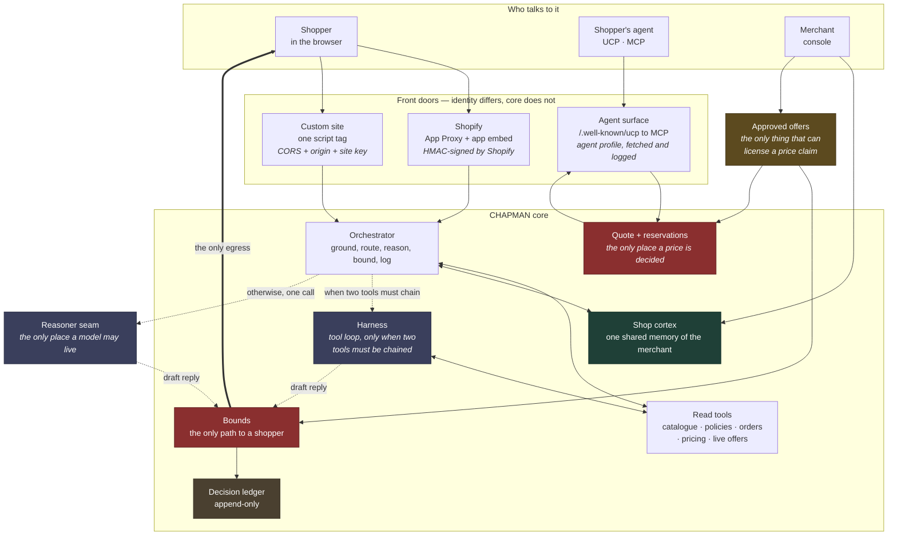

Two red boxes, and they are the two chokepoints. **The reasoner never holds the shopper's connection and never reaches the quote** — it returns text, and what happens to that text is not its decision.

The gold box is the keystone. An approved offer is the only thing in CHAPMAN that can make a price claim sayable, and it reaches both chokepoints: `bounds` may now permit the sentence, `quote` will now apply the rupees. Nothing else can license either.

---

## 3. The orchestrator, per message

The largest efficiency lever in a storefront assistant is not which model you pick — it is **how often you invoke one**.

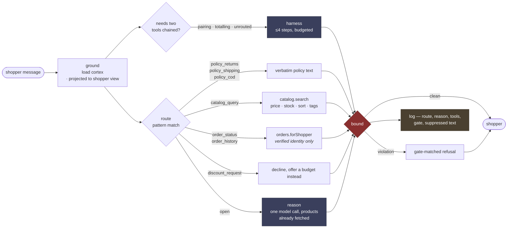

**Route first, reason second.** Every row above except `open` resolves with no model at all. A model is invoked only when the router abstains — and when it is, it arrives with products already in hand rather than spending a round trip asking for them. A router that guesses is worse than one that abstains, so anything unrecognised becomes `open`.

**Harness third.** The tool loop is reserved for messages where answering genuinely requires composing two tools — where the second call's arguments come out of the first call's results. There are exactly three such shapes, and they are named rather than guessed at:

| Shape | Example | Chain |
|---|---|---|
| **pairing** | *"something to go with masala chai"* | `search_products`, then `products_that_go_with` |
| **totalling** | *"what would two of those cost delivered?"* | `search_products`, then `price_basket` |
| **unrouted** | the router could not decide at all | its own signal |

Everything else takes the cheap path. Escalating every message would multiply latency and rate-limit burn fourfold to serve the fraction of traffic that needs it.

### The bounds layer

Four gates, in code, outside the model, on the only path to a shopper.

| Gate | Blocks |
|---|---|
| `unverifiable_discount` | any price reduction with no approved offer behind it |
| `unverifiable_urgency` | deadlines, "hurry", scarcity that no tool returned |
| `unapproved_event` | festive stock claims, "prices go up after" |
| `assumed_observance` | assuming what a shopper celebrates or believes |

A **true** stock number is allowed. If inventory really is 3, *"only 3 left"* is a fact, checked against what the tools returned. One digit different and the verdict flips.

**Streaming does not buy latitude.** Text is not forwarded as it arrives and checked at the end — by then the shopper has read it. The guard holds everything until a sentence completes, runs the full check, and only then releases. Verified at every chunk size from 1 to 500: a gate that depends on how the model happens to chunk is not a gate.

---

## 4. The tool registries

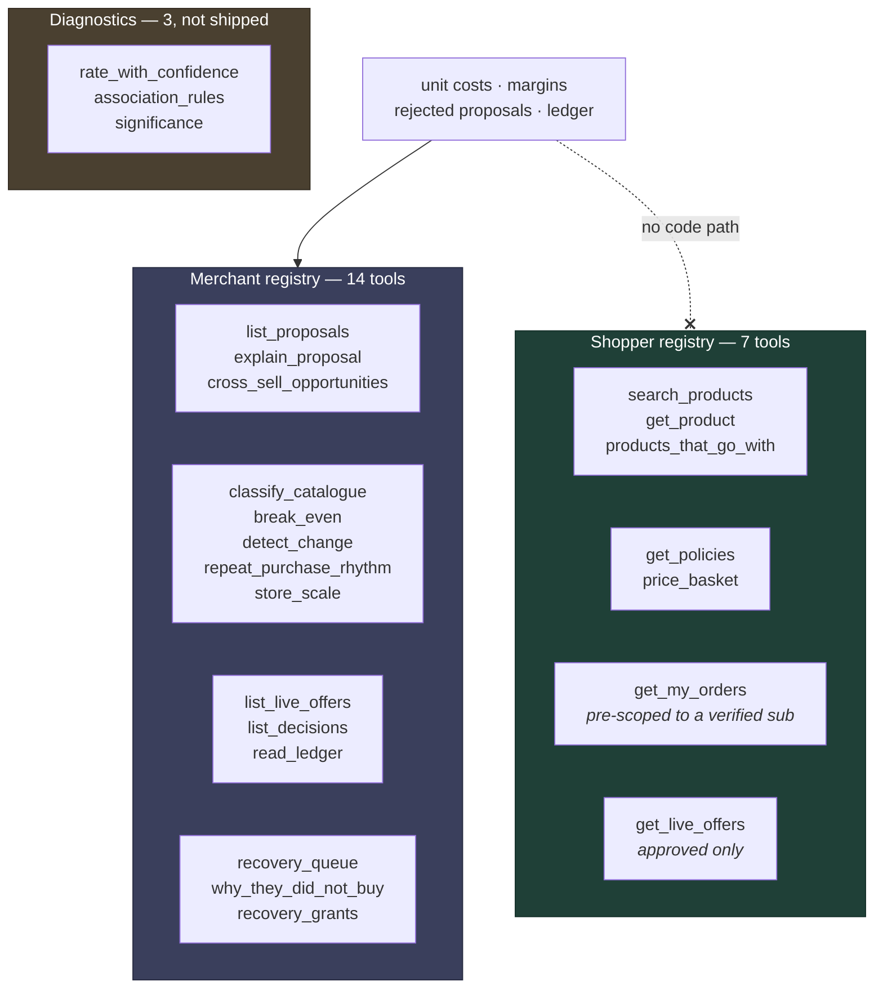

**Two registries, not one with a permission flag.** A single registry would need a check on every tool asking *"is this caller a merchant?"*, and that check is one forgotten line from handing a storefront visitor the merchant's unit costs — which are their negotiating position, not a product attribute. Two disjoint registries make the separation structural. Same reasoning that keeps the shop cortex and a shopper's memory in different stores.

**Every tool in both registries is a read.** There is no `checkout.start`, no `approve_offer`, no `publish`, no `refund`. Not an oversight to be filled in later — it is the architecture. A model that can call a tool that moves money is a model you are trusting with money. Approval stays a human clicking a button with an exposure cap in front of them.

Because the registry is data, it can be printed. The console shows a merchant the complete list of what the assistant is able to do, which is a much stronger assurance than a paragraph promising it behaves.

**Three of the merchant tools are about the recovery loop**, and one of them answers a question nothing else in the shop can. `recovery_queue` is who would be written to and — the more useful half — who would not, with the reason each was left alone. `recovery_grants` is what the discount policy has actually cost and how much budget is left. And `why_they_did_not_buy` returns what shoppers *said*, counted by reason: every other tool in either registry reports what happened, and this is the only one that reports why, because the why never touched the server. It carries its own sample floor, so a merchant cannot read four answers as a pattern by forgetting to check.

**The diagnostics are excluded on purpose.** A tool earns a place if a merchant would ask for it in those words. Nobody says *"give me the Wilson lower bound of 12 out of 29"* — and a model reaching for one is a signal that the deterministic pipeline should already have done that work and put the answer on a page.

### How a tool is called

Text JSON, not the OpenAI `tools` parameter, because the free models that stay up are inconsistent about native function calling. **Every turn must be one of exactly two objects:**

```json
{"tool": "search_products", "args": {"query": "chai", "price_max": 2000}}
{"answer": "We have two green teas — Nilgiri Frost at ₹480 and Cardamom at ₹520."}
```

Anything else is **invalid**, not merely untidy. That distinction is load-bearing: given a plain-prose escape hatch, a reasoning model wrote nine paragraphs of deliberation and never called anything, and no regex separates "thinking out loud" from "answering". Requiring `{"answer": …}` makes the difference machine-checkable, so a monologue is rejected exactly like a malformed call.

Three budgets, each for a different failure: **steps** (a model that keeps calling instead of answering), **wall clock** (a slow model or a hanging tool), and **repeats** (the same call twice, which is the commonest small-model loop and which a step budget punishes far too late).

---

## 5. The agent checkout, end to end

We did not invent a format. This speaks **UCP 2026-08-25**, verified live against `allbirds.com` and `gymshark.com` — both serve `/.well-known/ucp` pointing at an MCP endpoint, today.

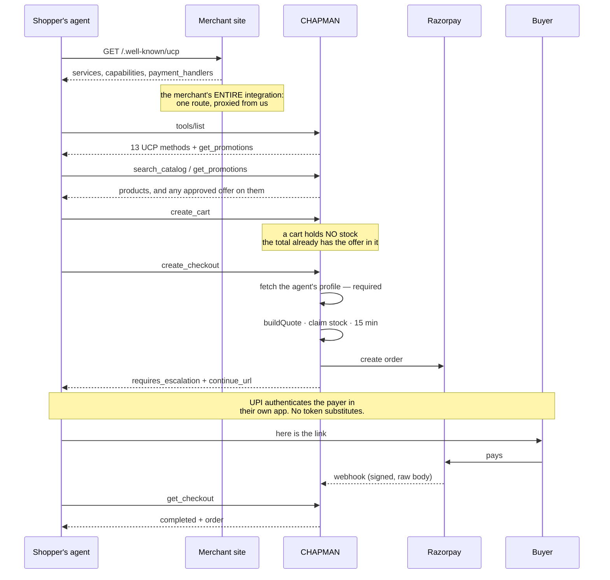

**A cart holds no stock; a checkout does.** An agent comparing five shops must not be able to freeze inventory at all five.

**An agent sees the same offers a person does, and cannot invent one.** Merchant-approved offers ride on every product, are listed by `get_promotions`, and come back as a negative `items_discount` line in the cart total — already applied, by the same server that will charge for it. The agent surface carries *terms* (10% off, until the 13th) and never an amount, because a product has no basket: the number exists only once a cart does. There is no field an agent can send a discount in. A recovery grant, which is bound to one shopper's basket and single-use, can be **redeemed** by an agent the buyer handed the code to — `discount_codes` on `create_cart` — but it can never be **discovered**: `get_promotions` will not list one.

<details>
<summary><b>A real bug, and how it hid</b></summary>

`create_cart` deliberately skipped the shop-scoped pricing path so that a cart would not reserve stock — and the same argument was what switched approved offers on. The cart quoted ₹740 while checkout charged ₹672. Every existing assertion passed, because each asked whether one surface was individually right and none asked whether the two agreed with each other. The suite now compares them.

</details>

**Escalation is not a shortfall.** `status: "requires_escalation"` with a `continue_url` is a defined outcome in the protocol, and on Indian rails it is the *only* honest one for the dominant payment method. Razorpay authenticates the payer directly — UPI inside their own banking app, cards and netbanking on Razorpay's hosted page — so there is no token an agent can hold that completes a purchase. We probed the Server-to-Server API to be sure rather than assuming: it is not open on this account. Advertising a capability we would fail at is the fabrication this codebase exists to avoid.

**Agent identity is a document you must be able to serve.** `meta["ucp-agent"].profile` is fetched and logged. It is not authentication — it proves whoever is calling controls a reachable URL — but it makes every stock hold attributable to a host, which is what a rate limit and an audit need. Reads stay anonymous, because a catalogue is public and refusing to answer protects nothing.

**Verified in both directions.** On 2026-09-06 the gateway was driven by the `ucp` CLI v0.8.0 — a reference client Shopify wrote and we did not — and, separately, by Claude over MCP with no adapter, which completed order `cho_TYfqxtQIEG5ObO`: two tins of Nilgiri Frost Green Tea, ₹960 less a ₹96 merchant-approved discount plus ₹60 shipping, **₹924 paid**. Our own probe passing is not the same thing as somebody else's client passing.

What survives as ours: UCP standardises *transacting* and has no opinion on bounds, the ledger, merchant approval, or Indian payment rails.

---

## 6. The offer pipeline

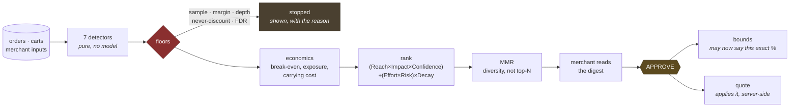

**An approval is a licence to SAY, not to apply.** The assistant may state that a 10% offer exists — that exact figure, that product, until that date. The rupees come from `buildQuote`, server-side, and the charge happens at the payment page. So the model still never produces a price, and an assistant that could grant a discount would be one that could be argued into one.

The same sentence is refused, then permitted after one click, then refused again on revocation. Nothing about the assistant changes.

### The seven detectors

`paymentFailures` · `stockIncidents` · `crossSell` · `replenishment` · `abandonment` · `paymentPreference` · `markdownCandidates` — all pure functions in `detectors.server.ts`, all run by `runDetectors`.

### Findings that shaped the statistics

All measured against the deterministic fixture.

- **Lift is the wrong default for co-purchase.** Rare pairs that co-occur twice by chance produce enormous lift. Hyper-lift divides by a hypergeometric quantile instead and demotes them.
- **The obvious pattern is the least valuable.** The highest-leverage pair is *already* bought together 42% of the time, so there is no headroom left in it. The surprising pair is where the money is — and that falls out of the arithmetic rather than being asserted.
- **Significance alone is not enough.** A planted trap — *"kettle buyers prefer COD"*, 2 of 3 orders — **passes** Fisher's exact at p = 0.028. It takes a Wilson lower bound, a sample floor, *and* false-discovery-rate control to kill it. None of the traps is special-cased: the detectors find them because they look like real patterns, and the floors are what stop them.
- **A normal-theory CUSUM is wrong for rare binary events.** Standardising a 0/1 outcome at an 11% base rate makes every failure a 2.9σ jump, so *two consecutive failures* clear a decision interval of 4. It raised a false alarm on two ordinary retries and dated a real outage four weeks early. Replaced with the sequential likelihood-ratio form.
- **Regularity must be measured per customer, then pooled.** Pooling every gap first measures the spread *between* people, not whether anyone has a cycle — masala chai came out at CV 0.88 that way and the detector found nothing at all.
- **We cannot estimate price elasticity and will not pretend to.** The store has never changed a price, so elasticity is unidentified, not merely biased. The proposer states the break-even lift and leaves the judgement to the merchant.
- **The most loyal customers are the worst discount target.** A cohort that reorders on a regular cycle is the definition of "sure things". Send a reminder — it costs nothing and does the same work.

### Three lanes, because they are three different kinds of thing

| Lane | Contains | Cadence | Margin cost |
|---|---|---|---|
| **Incidents** | payment-failure step changes, A-item stockouts, deep cover | immediate, not ranked | none |
| **Margin-safe actions** | cross-sell placement, replenishment reminders, cart outreach | weekly, ranked | zero |
| **Price experiments** | anything that gives up margin | one at a time, its own gate | bounded by a cap |

A payment outage is not an offer proposal. Putting it in a weekly ranked digest next to *"consider pairing these two teas"* is a category error, so the lanes are separate and only lane A is ranked.

---

## 7. Basket recovery — the third chokepoint

The proposer finds the *opportunity* — "82 baskets held a kettle and were never completed". A finding is not a campaign, and the distance between the two is where abandoned-cart tools go wrong.

**Outreach is speech at a distance.** It reaches someone who is not in a conversation, on a channel they gave us for a different purpose, with nobody present to say *that's wrong*. So the bar is the widget's bar and then some — the opposite of the direction marketing tools drift.

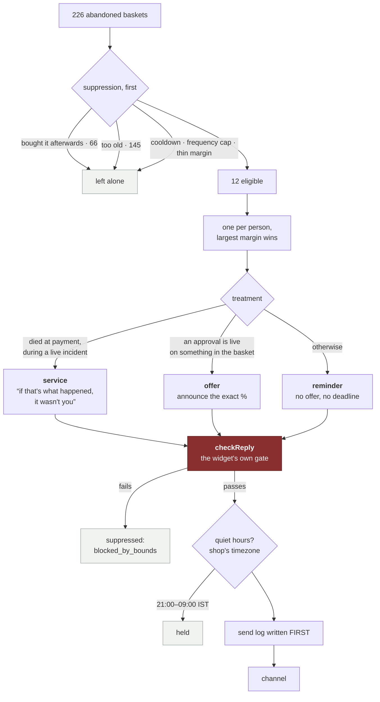

Three properties, each enforced by code rather than by care:

**It never asks for a discount.** There is no code path that creates an offer. If the merchant has already approved one on something in the basket, the message may ANNOUNCE it — exact percentage, real end date, applied by the server at the payment page. Otherwise it is a plain reminder, and that is the intended outcome, not a degraded one. Money off pays people who were going to buy anyway and teaches the rest to abandon deliberately.

**Its best answer is often "we broke it".** A basket that died on the payment step during a live payment incident is not a wavering shopper; it is our failure wearing a shopper's clothes. The recovery agent reads the incident detector for exactly this — and still hedges, because a cart record carries no payment method, so we cannot tie *this* basket to *that* bank.

**Suppression is computed first and shown in full**, the same discipline as `rejected` on the offers page. 214 of 226 baskets are left alone, each with one of sixteen named reasons and — where a threshold fired — the value and the threshold it missed. A campaign tool that shows you only its reach has hidden the number that can embarrass you.

### The sixteen suppression reasons

`outreach_off` · `recovered` · `already_bought` · `no_channel` · `no_consent` · `too_soon` · `too_old` · `already_messaged_cart` · `contacted_recently` · `frequency_cap` · `margin_too_thin` · `duplicate_customer` · `over_run_cap` · `already_asked` · `said_no` · `blocked_by_bounds`

### Channels are capabilities, not config flags

`whatsapp`, `sms` and `email` have **no `deliver` function**, only a sentence saying what would unlock them. A boolean can be flipped by editing a settings file; a missing function cannot.

**Voice is the exception that proves the rule** — it does deliver, and what gates it is still not a preference: availability is computed from whether the credentials exist. The suite removes one environment variable and asserts the channel goes dark, then enables outreach and raises every ceiling and asserts it stays dark. A settings file cannot buy a Twilio account.

**On the constraint being the feature.** WhatsApp needs Meta-approved templates; SMS needs DLT registration — entity, sender header and *every content template* filed with the Indian regulator before one message sends. DLT is usually described as friction. It is really an externally enforced version of the rule this codebase already imposes on itself: **the body is fixed, reviewed by someone who is not us, and only the variables move.** Our templates map onto DLT templates one to one because they were written under the same constraint. A system that generated free-form recovery copy with a language model *could not be sent over Indian SMS at all.*

---

## 8. Asking why, and what an answer earns

A recovery message that only says "you left this behind" recovers a basket at best. **The reason is worth more than the basket**: everything a shop can measure says WHAT happened, and nothing says why, because the why never touched the server. So the message asks one question, and the page it points at is the only place the shopper gets to answer.

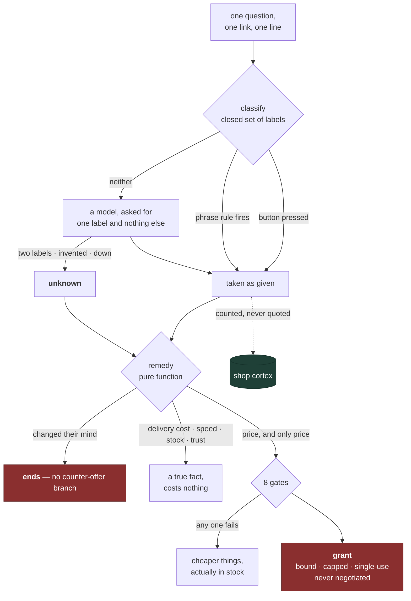

### The closed set

Eleven reasons plus `unknown` — `price_too_high` · `shipping_cost` · `shipping_speed` · `payment_failed` · `out_of_stock` · `checkout_friction` · `payment_method` · `changed_mind` · `just_browsing` · `comparing` · `trust` · `unknown`.

**The classifier never learns which answer pays out.** Its prompt mentions no discount, no offer, no standing and no basket value — it is labelling a sentence. A classifier that knows one label leads to money is a classifier with an incentive.

**Eight gates stand in front of one discount**, and the two that matter most: `requiresTier` may not be `new` — refused when the merchant saves, not merely defaulted, because an agent that pays whoever complains has taught everyone to complain — and the depth is the *smaller* of the recovery policy and the merchant's existing discount ceiling, then refused outright if the discounted basket falls through the margin floor.

**The guarantee, verified live rather than only asserted:**

```
"too expensive"        ─▶  8% off, 2 units, 48 hours
"still too expensive"  ─▶  the same 8%, the same grant id
"come on, 25%?"        ─▶  the same 8%, the same grant id
```

An agent that improves its offer under pressure has taught the customer base to push, and that lesson travels faster than any campaign. The grant reaches `buildQuote` **by id**, never as terms; it does not stack with an approved offer; and it is dead the moment it is spent — but the redemption keeps the order id, so a shopper who closed the tab lands back on the same payment page instead of being told their discount is gone.

**And "I changed my mind" ends it.** There is no counter-offer branch, deliberately, and the refusal silences that *person* rather than that basket. Every instinct in commerce says this is the moment to try one more thing. It is the moment somebody told you plainly that they do not want it.

### Voice: the channel that had to earn it

**Sarvam** for speech (`bulbul:v3`, chosen for Hinglish, because that is how the shopper actually talks) and **Twilio** to place the call. It rings a real handset, in two modes the merchant picks between — and the default is the smaller one.

`notice` reads the bounds-checked draft and hangs up. No model is near the audio and there is nowhere to put one: the remedy is decided and the grant issued before anyone speaks, and the voice layer only reads out a sentence that already passed `checkReply`.

`conversation` lets the shopper answer, because **the reason is the product and people say more than they type.** A web form gets an answer from the minority who click; somebody already mid-sentence on the phone just tells you. The spoken answer is classified into the same labels and lands in the same histogram as a typed one — there is no second store of voice reasons, because two stores of the same fact is how a merchant ends up with two answers to "why aren't they buying".

Voice is the one channel where a fabricated discount leaves no screenshot, cannot be retracted and cannot be disproved. So the guarantee is not a prompt instruction — **the model is handed no discount, no ceiling and no mention that grants exist.** Its entire world of facts is the array the drafting layer already uses to bound a written message. On a live call it was pushed five ways — politely, then on loyalty, then desperation, then a fabricated *"your owner said I'd get one"* — and refused every time, because there was no figure in its context to concede.

And **press 9 stops it.** A written message can say "reply STOP"; a spoken one cannot, and an instruction the listener cannot follow only sounds like an opt-out. A keypress writes the same `closed` turn the web page writes, which is the suppression every future run already reads.

**The URL carries a token that NAMES a draft; it never carries the sentence** — for the same reason `buildQuote` takes a grant id and not a depth.

---

## 9. Two memories, and why they are not one

The shop cortex holds what is true about a **merchant**: policies, catalogue shape, floors, what the last analysis found. It has no field that can carry a person, and that is the guarantee rather than an omission — `check-cortex` asserts it against real secret *values*, not key names.

So where does "this shopper drinks it black" go? Into its own store, keyed `(merchant, shopper)`.

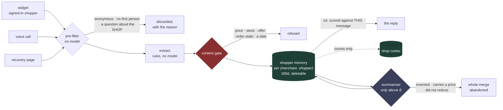

> **Memory supplies the question. Tools supply the answer.**

Memory says *"they prefer low caffeine."* The catalogue then says which products are low caffeine, at what price, in stock today. So a stale memory can be wrong about a preference — recoverable, the shopper corrects it in a sentence — and can never be wrong about a price, **because it is not allowed to contain one.** That is `checkMemory`, the bounds layer pointed at storage instead of at speech, and it runs on the way *in*: the only place it can run, because the sentence will be read back in March.

Four more properties, each structural:

- **No identity, no memory.** An anonymous shopper is never persisted — with no identity there is no way to honour a deletion request later, so collecting would be taking something we could never give back.
- **Per merchant, always.** The same human at two CHAPMAN shops has two disjoint memories that never meet.
- **Stated, not silent.** The prompt block tells the model to say so when it uses one — *"last time you were after something low-caffeine, still?"* — because stated memory is correctable and silent memory is spooky and, when wrong, invisible.
- **It ages out.** 180 days, refreshed on use, deletable by the shopper from the widget and by the merchant from the console.

**The summariser, and the guard that makes one safe.** One line per extracted fact becomes a pile, so above eight lines a small model rewrites them as fewer, clearer ones. It is a model writing sentences that will be said to a customer as things the shop knows about them, so asking it nicely not to invent is not a control. Every line must clear three checks — the same content gate, *grounded in the input* (it must overlap a line it could have come from), and *it may only reduce* — and if any line fails, **the whole merge is abandoned** and the originals stand. A half-merged pile is worse than an untidy one. A boundary (*"don't contact me"*) is never merged and is never shown to the summariser at all.

Measured: twelve lines to nine in 3.9s on `lfm-2.5-2.6b`, with merges like *"usually orders two packets every six weeks for a small office."* Small model first, deliberately — a 26B head took **eleven seconds** for the same job, and the two fastest models available leak their chain of thought into `content`, which in a list-of-lines job would make every leaked paragraph a candidate memory.

**What crosses into the cortex is a count.** The reason histogram, the answer rate — never a sentence, never a person. And it crosses through `updateFindings`, which merges one section, because the whole-document writer would blank the service notices and stop the assistant warning shoppers mid-outage.

---

## 10. The storefront, wired both ways

Recovery used to run entirely on `npm run seed`. A shopper could fill a basket on the real store, close the tab, and nothing anywhere knew.

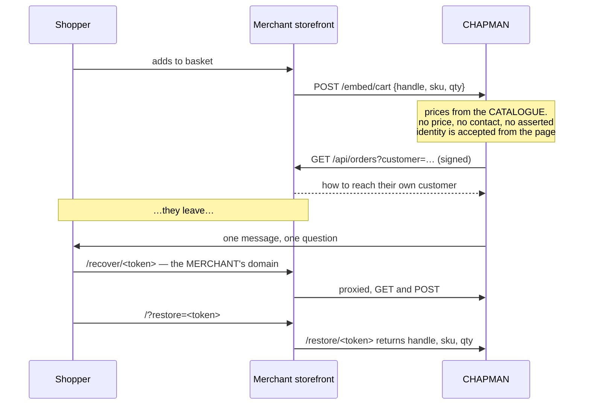

Three things the capture endpoint refuses to take from the browser, each of which looks fine in a demo:

1. **A price.** A posted line is `{handle, sku, qty}` — the same shape the checkout uses — so a basket cannot be inflated in the console into a recovery target worth chasing, and the margin floor is not computed from a number the shopper chose.
2. **A phone number.** Accepting contact from a page would let anyone aim the shop's outbound calls at a stranger's handset. The page proves *who* it is with the signed session token the merchant already puts there; resolving that to *how to reach them* is the merchant's business, answered server to server over the same signed request that serves their orders. No token means no contact, which means the basket is suppressed as `no_channel` — **shown, with that reason.** The correct outcome, not a gap.
3. **An identity it merely asserts.**

**The question is asked on the merchant's domain.** A shopper who was on monsoonmarket.example should not answer "why didn't you buy?" on a gateway domain they have never heard of — that reads like phishing and gets closed. So the merchant proxies two paths, exactly the `/.well-known/ucp` pattern and about as much code, and the token is unchanged by moving: it is signed with the site secret and verified by us, so relocating the URL relocates no trust. Both directions are forwarded, because forwarding only the GET would render the question perfectly and throw the answer away.

Live baskets are kept in **their own file**, not `carts.jsonl`. `npm run seed` rewrites that one wholesale, so a real basket written there survives until the next seed and then vanishes — intermittent data loss, only ever in the direction that makes a demo look fine.

---

## 11. The return path into the cortex

The cortex fed the proposer from the day both existed — floors, costs, catalogue shape. Nothing came back. So the system could establish on Tuesday that netbanking was failing at 41%, and the assistant talking to a shopper on Wednesday knew nothing and would suggest they try again.

The obvious fix — have `buildCortex` call `runProposals` — is wrong: the cortex sits on the shopper's path, cached for sixty seconds, and the proposer reads eight hundred orders through seven detectors and a false-discovery correction. So **the proposer publishes and the cortex reads**, as a small document with a `ranAt` on it. Findings go stale, they say so, and "the last analysis ran nine days ago" is itself worth surfacing.

Exactly one thing crosses to a shopper:

> *"Some HDFC netbanking payments have not been going through recently. If one fails, UPI and cards are working normally."*

Written by the server from the detector's own facts, bounds-checked before it was stored, dropped after seven days whether or not anyone re-ran the analysis. Note the three absences: **no failure rate** (telling a shopper 41% of netbanking fails invites them to distrust the methods that work), **no date** (the onset is a window, and the honest version of a window is not a customer-service sentence), and no apology for something we have not confirmed is ours.

**Relevance is a routing decision, not a model's judgement.** That was learned the hard way. The notice was first placed in the FACTS block with an instruction that it "may be repeated when relevant" — and a shopper who said their netbanking payment had just failed, during the outage, with the sentence sitting right there, was told that payment troubleshooting is handled by the support team. Then a model that had declined to use one announced to a shopper that *"there is no service notice in our system right now"*.

So the model never sees a notice at all. `router.server.ts` classifies the message as `payment_trouble`, the notice's subject is matched against the method the shopper actually named — somebody whose **card** was declined is not handed a sentence about netbanking — and the answer is returned verbatim with no model in the path.

---

## 12. Feature architecture diagrams

These diagrams follow the dashboard navigation. They show the main inputs,
server-side boundary, persisted state, and external dependency for each
feature. Provider credentials are always read on the server. Dashboard loaders
return variable names and readiness booleans, never secret values.

### Overview and first-store setup

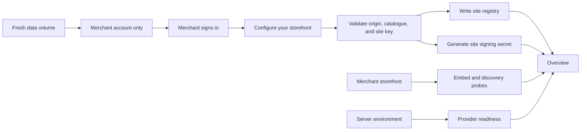

Registration, installation, and provider readiness are separate inputs to the
Overview. A registered site is not automatically marked as installed.

### Feature controls

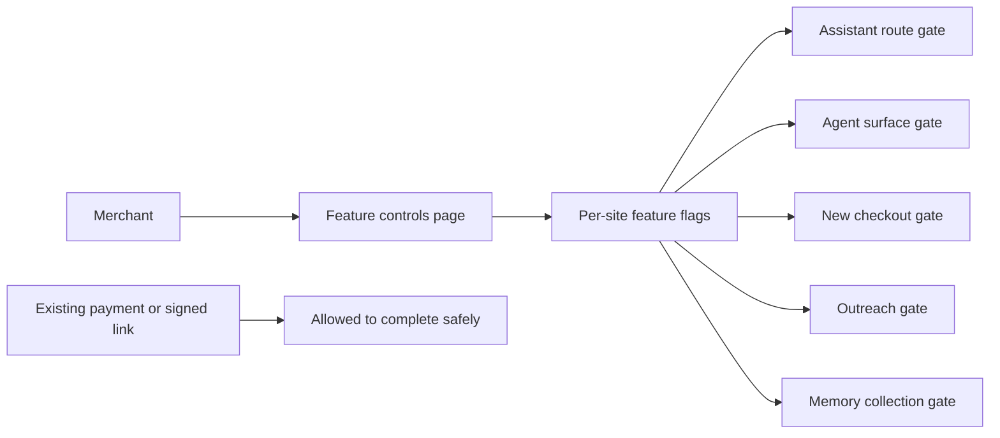

Feature controls express merchant policy. They do not replace installation
probes or provider credential checks. In-flight payments and signed recovery
links are not abandoned after a flag changes.

### Storefront assistant

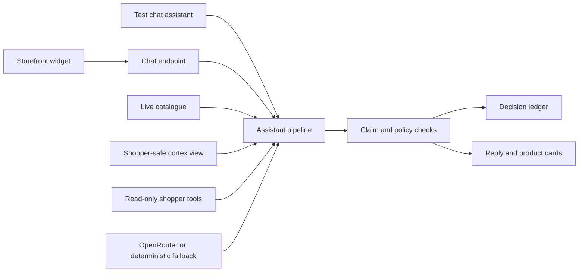

The dashboard preview uses the same pipeline as the widget. It runs without a
shopper identity, so it cannot read personal orders or shopper memory.

### Agent front

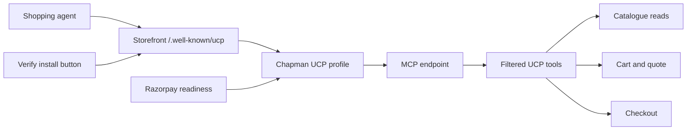

Agent discovery needs a storefront route, not a provider key. The public
profile advertises Razorpay only when the site is linked and both required key
variables resolve.

### Razorpay checkout and settlement

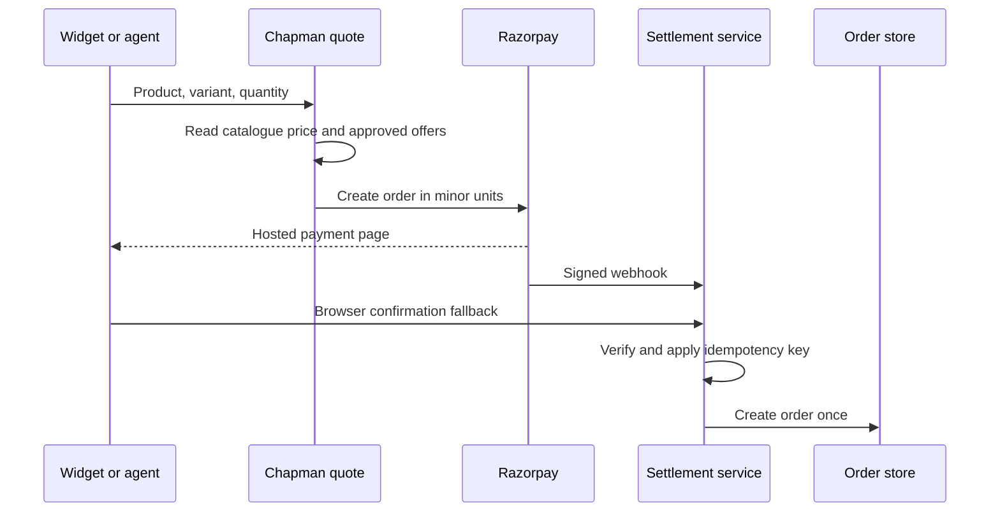

The client never submits a price. Webhook and browser confirmation use the same
idempotent settlement path.

### Offers and approvals

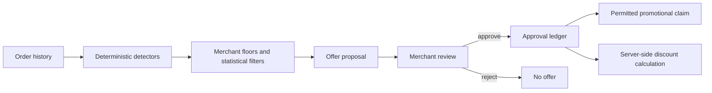

An approval permits a specific claim and lets the quote service apply the
matching calculation. A model cannot create or change the discount.

### Recovery and voice

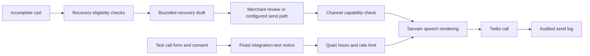

The test form supplies only the destination. It does not load a customer record
or place the number in model input. Test calls use notice mode even when normal
recovery is conversational.

### Shopper memory

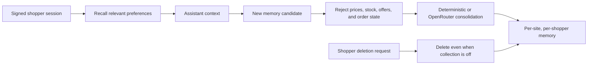

Anonymous shoppers are not remembered. Information that can expire, such as a
price or order status, is not valid shopper memory.

### Shop cortex

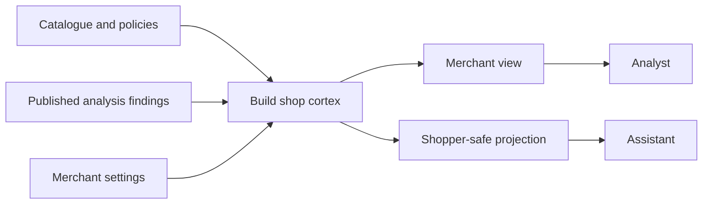

The cortex holds knowledge about the shop, not a shopper. Sensitive merchant
facts remain outside the shopper projection.

### Analyst

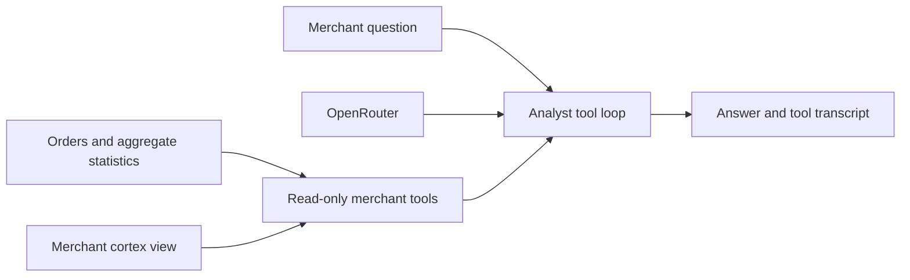

Unlike the storefront assistant, the Analyst requires OpenRouter because its
job is to choose and combine merchant tools for an open-ended question. Tools
remain read-only.

### Identity and order access

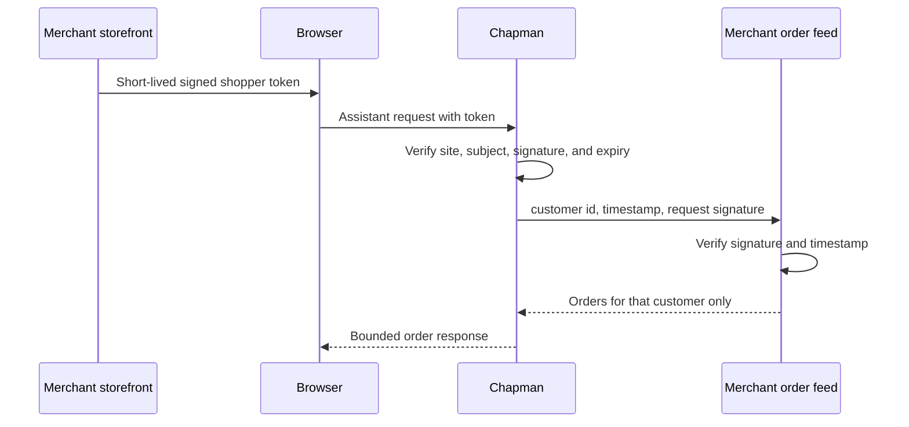

Typed email addresses, phone numbers, and order numbers do not establish
identity. Signed-out assistant previews therefore cannot access order data.

### Decision ledger and test bench

```mermaid
flowchart LR
    Assistant[Assistant decisions] --> Ledger[Append-only decision ledger]
    Bounds[Blocked claims] --> Ledger
    Offers[Offer approvals] --> Ledger
    Recovery[Recovery sends] --> Ledger
    TestBench[Test bench] --> Live[Live assistant and readiness checks]
    Live --> Results[Pass, fail, and evidence]
    Live --> Ledger
```

The ledger remains available when shopper-facing features are disabled. The
test bench exercises live paths so it can detect configuration failures that a
static feature list cannot.

---

## 13. Where each rule is enforced

| Rule | Enforced in | The failure it prevents |
|---|---|---|
| Reads are tools | `tools.server.ts`, `merchanttools.server.ts` | a model calling something that moves money |
| Speech is a chokepoint | `bounds.server.ts` — the only egress | an invented discount, deadline or scarcity claim reaching a shopper |
| Money is a chokepoint | `quote.server.ts` + `reservations.server.ts` | a price arriving from the client |
| Only an approval licenses a price claim | `approvals.server.ts` | an assistant that can be argued into a discount |
| Anything countable is counted by code | `stats.server.ts`, `detectors.server.ts`, `economics.server.ts` | a plausible number that is wrong |
| Floors run before the model | `floors.server.ts` | a trap that passes Fisher's exact reaching a merchant |
| A grant is passed by id, never as terms | `grants.server.ts`, then `buildQuote` | a caller that could pass a depth could pass 90% |
| Memory may not hold anything that expires | `checkMemory` in `memory.server.ts` | a price read back to a shopper in March |
| The cortex may not hold a person | `cortex.server.ts` + `check-cortex` | merchant unit costs, or a shopper, in the wrong projection |
| Identity comes only from a signed session | `identity.server.ts` | order lookup by an email a stranger can type |
| One settlement path, idempotent | `settle.server.ts` | double-settling, overselling, a forged webhook |
| Three credential classes stay apart | `sites.server.ts`, `auth.server.ts`, `razorpay.server.ts` | one credential quietly standing in for another |
| Channels are capabilities | `outreach.server.ts` | a settings file that appears to buy a Twilio account |
| A model is optional | `reasoner.server.ts`, `pickReasoner()` | an outage that looks like a product failure |
| A published page carries terms, never a discounted number | `agentview.server.ts` | a browsing model quoting a total nobody will honour |
| The legibility layer computes nothing on the merchant's side | `demo-store/agentfront.go` | a second place prices come from, free to disagree with the first |

---

[Back to README](../README.md)
